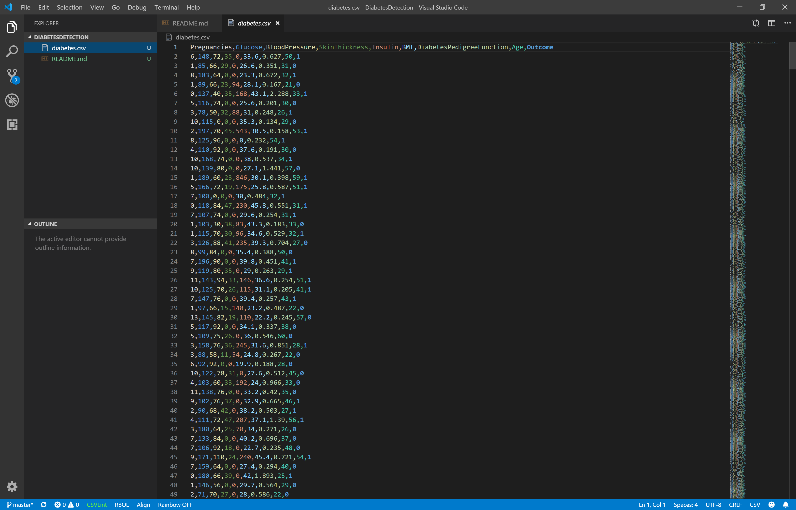

# The case

The Pima are a tribe of North American Indians who traditionally lived along the Gila and Salt rivers in Arizona, U.S., in what was the core area of the prehistoric Hohokam culture. They speak a Uto-Aztecan language and call themselves the River People and are usually considered to be the descendants of the Hohokam.

But there's a weird thing about the Pima: they have the highest reported prevalence of diabetes of any population in the world.  Their diabetes is exclusively type 2 diabetes, with no evidence of type 1 diabetes, even in very young children with an early onset of the disease.

This suggests that the Pima carry a specific gene mutation that makes them extremely susceptive to diabetes. The tribe has been the focus of many medical studies over the years.

In this case study, you're going to participate in one of these medical studies. You will build an app that loads a dataset of Pima medical records and tries to predict from the data who has diabetes and who has not. 

How accurate will your app be? Do you think you will be able to correctly predict every single diabetes case? 

That's for you to find out! 

# The dataset



In this case study you'll be working with a dataset containing the medical records of 768 Pima women. 

There is a single file in the dataset:
* [diabetes.csv](https://github.com/mdfarragher/DSC/blob/master/BinaryClassification/DiabetesDetection/diabetes.csv) which contains 768 records, 8 input features, and 1 output label. You will use this file to train and test your model.

You'll need to [download the dataset](https://github.com/mdfarragher/DSC/blob/master/BinaryClassification/DiabetesDetection/diabetes.csv) and save it in your project folder to get started.

Here's a description of all columns in the file:
* **Pregnancies**: the number of times the woman got pregnant
* **Glucose**: the plasma glucose concentration at 2 hours in an oral glucose tolerance test
* **BloodPressure**: the diastolic blood pressure (mm Hg)
* **SkinThickness**: the triceps skin fold thickness (mm)
* **Insulin**: the 2-hour serum insulin concentration (mu U/ml)
* **BMI**: the body mass index (weight in kg/(height in m)^2)
* **DiabetesPedigreeFunction**: the diabetes pedigree function
* **Age**: the age (years)
* **Outcome**: the label you need to predict - 1 if the woman has diabetes, 0 if she has not


# Getting started
Go to the console and set up a new console application:

```bash
$ dotnet new console -o DiabetesDetection
$ cd DiabetesDetection
```

Then install the ML.NET NuGet package:

```bash
$ dotnet add package Microsoft.ML
$ dotnet add package Microsoft.ML.FastTree
```

And launch the Visual Studio Code editor:

```bash
$ code .
```

The rest is up to you! 

# Your assignment
I want you to build an app that reads the data file and splits it for training and testing. Reserve 80% of all records for training and 20% for testing. 

Process the data and train a binary classifier on the training partition. Then use the fully-trained model to generate predictions for the records in the testing partition. 

Decide which metrics you're going to use to evaluate your model, but make sure to include the **AUC** too. Report your best values in our group.

See if you can get the AUC as close to 1 as possible. Share in our group how you did it. Which features did you select, how did you process them, and how did you configure your model? 

Good luck!