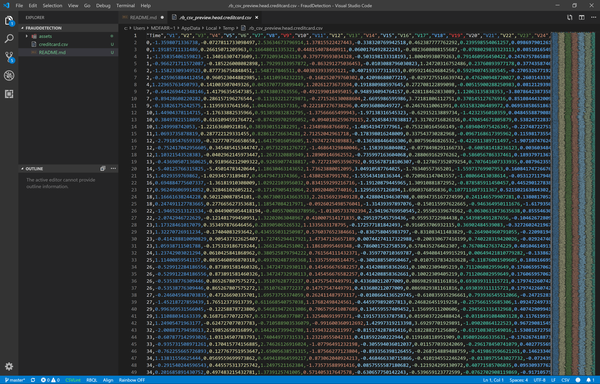

# The case

It is very important that credit card companies are able to recognize fraudulent credit card transactions so that customers are not charged for items that they did not purchase.

Credit card fraud happens a lot. During two days in September 2013 in Europe, credit card networks recorded at least 492 fraud cases out of a total of 284,807 transactions. That's 246 fraud cases per day!

In this case study, you're going to help credit card companies detect fraud in real time. You will build an app and train it on detected fraud cases, and then test your predictions on a new set of transactions. 

How accurate will your app be? Do you think you will be able to detect financial fraud in real time? 

That's for you to find out! 

# The dataset



In this case study you'll be working with a dataset containing transactions made by credit cards in September 2013 by European cardholders. This dataset presents transactions that occurred in two days, where we have 492 frauds out of 284,807 transactions. 

Note that the dataset is highly unbalanced, the positive class (frauds) account for only 0.172% of all transactions.

The data set contains 285k records, 30 feature columns, and a single label indicating if the transaction is fraudulent or not. You can use any combination of features you like to generate your fraud predictions.

There is a single file in the dataset:
* [creditcard.csv](https://www.kaggle.com/mlg-ulb/creditcardfraud/downloads/creditcard.csv/3) which contains 285k records, 30 input features, and one output label. You will use this file to train and test your model.

The file is about 150 MB in size. You'll need to [download it from Kaggle](https://www.kaggle.com/mlg-ulb/creditcardfraud/downloads/creditcard.csv/3) to get started. [Create a Kaggle account](https://www.kaggle.com/account/login) if you don't have one yet. 

Here's a description of all 31 columns in the data file:
* Time: Number of seconds elapsed between this transaction and the first transaction in the dataset
* V1-V28: A feature of the transaction, processed to a number to protect user identities and sensitive information
* Amount: Transaction amount
* Class: 1 for fraudulent transactions, 0 otherwise

# Getting started
Go to the console and set up a new console application:

```bash
$ dotnet new console -o FraudDetection
$ cd FraudDetection
```

Then install the ML.NET NuGet package:

```bash
$ dotnet add package Microsoft.ML
$ dotnet add package Microsoft.ML.FastTree
```

And launch the Visual Studio Code editor:

```bash
$ code .
```

The rest is up to you! 

# Your assignment
I want you to build an app that reads the data file in memory and splits it. Use 80% for training and 20% for testing.

You can select any combination of input features you like, and you can perform any kind of data processing you like on the columns. 

Processes the selected input features, then train a binary classifier on the data, and generate predictions for the transactions in the testing partition. 

Use the trained model to make fraud predictions on the test data. Decide which metrics you're going to use to evaluate your model, but make sure to include the **AUC** too. Report your best values in our group.

See if you can get the AUC as close to 1 as possible. Share in our group how you did it. Which features did you select, how did you process them, and how did you configure your model? 

Good luck!