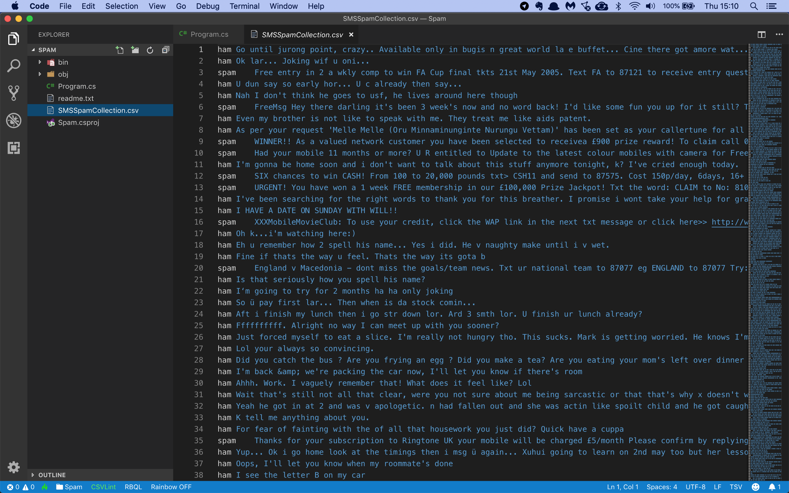

# Assignment: Detect spam SMS messages

In this assignment you're going to build an app that can automatically detect spam SMS messages.

The first thing you'll need is a file with lots of SMS messages, correctly labelled as being spam or not spam. You will use a dataset compiled by Caroline Tagg in her [2009 PhD thesis](http://etheses.bham.ac.uk/253/1/Tagg09PhD.pdf). This dataset has 5574 messages.

Download the [list of messages](https://github.com/mdfarragher/DSC/blob/master/BinaryClassification/SpamDetection/spam.tsv) and save it as **spam.tsv**.

The data file looks like this:



It’s a TSV file with only 2 columns of information:

* Label: ‘spam’ for a spam message and ‘ham’ for a normal message.
* Message: the full text of the SMS message.

You will build a binary classification model that reads in all messages and then makes a prediction for each message if it is spam or ham.

Let’s get started. You need to build a new application from scratch by opening a terminal and creating a new NET Core console project:

```bash
$ dotnet new console -o SpamDetection
$ cd SpamDetection
```

Now install the following ML.NET packages:

```bash
$ dotnet add package Microsoft.ML
```

Now you are ready to add some classes. You’ll need need one to hold a labelled message, and one to hold the model predictions.

Modify the Program.cs file like this:

```csharp
using System;
using System.IO;
using System.Linq;
using Microsoft.ML;
using Microsoft.ML.Data;

namespace SpamDetection
{
    /// <summary>
    /// The SpamInput class contains one single message which may be spam or ham.
    /// </summary>
    public class SpamInput
    {
        [LoadColumn(0)] public string RawLabel { get; set; }
        [LoadColumn(1)] public string Message { get; set; }
    }

    /// <summary>
    /// The SpamPrediction class contains one single spam prediction.
    /// </summary>
    public class SpamPrediction
    {
        [ColumnName("PredictedLabel")] public bool IsSpam { get; set; }
        public float Probability { get; set; }
        public float Score { get; set; }
    }

    // the rest of the code goes here....
}
```
The **SpamInput** class holds one single message. Note how each field is tagged with a **LoadColumn** attribute that tells the data loading code which column to import data from.

There's also a **SpamPrediction** class which will hold a single spam prediction. There's a boolean **IsSpam**, a **Probability** value, and the **Score** the model will assign to the prediction.

Now look at the first column in the data file. Our label is a string with the value 'spam' meaning it's a spam message, and 'ham' meaning it's a normal message. 

But you're building a Binary Classifier which needs to be trained on boolean labels.

So you'll have to somehow convert the 'raw' text labels (stored in the **RawLabel** field) to a boolean value. 

To set that up, you'll need two helper classes:

```csharp
/// <summary>
/// This class describes which input columns we want to transform.
/// </summary>
public class FromLabel
{
    public string RawLabel { get; set; }
}

/// <summary>
/// This class describes what output columns we want to produce.
/// </summary>
public class ToLabel
{
    public bool Label { get; set; }
}

// the rest of the code goes here....
```

Note the **FromLabel** class that contains the 'raw' unprocessed text label value, and the **ToLabel** class that contains the converted boolean label value. 

Now you're going to load the training data in memory:

```csharp
/// <summary>
/// The main program class.
/// </summary>
public class Program
{
    // filenames for data set
    private static string dataPath = Path.Combine(Environment.CurrentDirectory, "spam.tsv");

    /// <summary>
    /// The main program entry point.
    /// </summary>
    /// <param name="args">The command line parameters.</param>
    static void Main(string[] args)
    {
        // set up a machine learning context
        var context = new MLContext();

        // load the spam dataset in memory
        var data = context.Data.LoadFromTextFile<SpamInput>(
            path: dataPath, 
            hasHeader: true, 
            separatorChar: '\t');

        // use 80% for training and 20% for testing
        var partitions = context.Data.TrainTestSplit(
            data, 
            testFraction: 0.2);

        // the rest of the code goes here....
    }
}
```
This code uses the method **LoadFromTextFile** to load the TSV data directly into memory. The class field annotations tell the method how to store the loaded data in the **SpamInput** class.

The **TrainTestSplit** method then splits the data into a training partition with 80% of the data and a test partition with 20% of the data.

Now you’re ready to start building the machine learning model:

```csharp
// set up a training pipeline
// step 1: transform the 'spam' and 'ham' values to true and false
var pipeline = context.Transforms.CustomMapping<FromLabel, ToLabel>(
    mapAction: (input, output) => { output.Label = input.RawLabel == "spam" ? true : false; }, 
    contractName: "MyLambda")

    // step 2: featureize the input text
    .Append(context.Transforms.Text.FeaturizeText(
        outputColumnName: "Features", 
        inputColumnName: nameof(SpamInput.Message)))

    // step 3: use a stochastic dual coordinate ascent learner
    .Append(context.BinaryClassification.Trainers.SdcaLogisticRegression());

// the rest of the code goes here....
```
Machine learning models in ML.NET are built with pipelines, which are sequences of data-loading, transformation, and learning components.

This pipeline has the following components:

* A **CustomMapping** that transforms the text label to a boolean value. We define 'spam' values as spam and anything else as normal messages.
* **FeaturizeText** which calculates a numerical ngram value for each message. This is a required step because machine learning models cannot handle text data directly.
* A **SdcaLogisticRegression** classification learner which will train the model to make accurate predictions.

The FeaturizeText component is a very nice solution for handling text input data. The component performs a number of transformations on the text to prepare it for model training:

* Normalize the text (=remove punctuation, diacritics, switching to lowercase etc.)
* Tokenize each word.
* Remove all stopwords
* Extract Ngrams and skip-grams
* TF-IDF rescaling
* Bag of words conversion

The result is that each message is converted to a vector of numeric values that can easily be processed by the model.

Before you start training, you're going to perform a quick check to see if the dataset has enough data to reliably train a binary classification model.

We have 5574 messages. This is a decently-sized dataset but a bit on the low side. We'd prefer to have between 10k-100k records for reliable training. For small datasets like this one, we'll have to perform **K-Fold Cross Validation** to make sure we have enough data to work with. 

Let's set that up right now:

```csharp
// test the full data set by performing k-fold cross validation
Console.WriteLine("Performing cross validation...");
var cvResults = context.BinaryClassification.CrossValidate(
    data: partitions.TrainSet, 
    estimator: pipeline, 
    numberOfFolds: 5);

// report the results
foreach (var r in cvResults)
    Console.WriteLine($"  Fold: {r.Fold}, AUC: {r.Metrics.AreaUnderRocCurve}");
Console.WriteLine($"   Average AUC: {cvResults.Average(r => r.Metrics.AreaUnderRocCurve)}");
Console.WriteLine();

// the rest of the code goes here....
```

This code calls the **CrossValidate** method to perform K-Fold Cross Validation on the training partition using 5 folds, and then reports the individual AUC for each fold and the average AUC over all folds.

Now let's train the model and get some validation metrics:

```csharp
// train the model on the training set
Console.WriteLine("Training the model...");
var model = pipeline.Fit(partitions.TrainSet);

// evaluate the model on the test set
Console.WriteLine("Evaluating the model...");
var predictions = model.Transform(partitions.TestSet);
var metrics = context.BinaryClassification.Evaluate(
    data: predictions, 
    labelColumnName: "Label", 
    scoreColumnName: "Score");

// report the results
Console.WriteLine($"  Accuracy:          {metrics.Accuracy:P2}");
Console.WriteLine($"  Auc:               {metrics.AreaUnderRocCurve:P2}");
Console.WriteLine($"  Auprc:             {metrics.AreaUnderPrecisionRecallCurve:P2}");
Console.WriteLine($"  F1Score:           {metrics.F1Score:P2}");
Console.WriteLine($"  LogLoss:           {metrics.LogLoss:0.##}");
Console.WriteLine($"  LogLossReduction:  {metrics.LogLossReduction:0.##}");
Console.WriteLine($"  PositivePrecision: {metrics.PositivePrecision:0.##}");
Console.WriteLine($"  PositiveRecall:    {metrics.PositiveRecall:0.##}");
Console.WriteLine($"  NegativePrecision: {metrics.NegativePrecision:0.##}");
Console.WriteLine($"  NegativeRecall:    {metrics.NegativeRecall:0.##}");
Console.WriteLine();

// the rest of the code goes here
```

This code trains the model with a call to **Fit**, then calls **Transform** to make a prediction for every message in the validation partition, and **Evaluate** to compare these predictions to the ground truth and calculate the following metrics:

* **Accuracy**: this is the number of correct predictions divided by the total number of predictions.
* **AreaUnderRocCurve**: a metric that indicates how accurate the model is: 0 = the model is wrong all the time, 0.5 = the model produces random output, 1 = the model is correct all the time. An AUC of 0.8 or higher is considered good.
* **AreaUnderPrecisionRecallCurve**: an alternate AUC metric that performs better for heavily imbalanced datasets with many more negative results than positive.
* **F1Score**: this is a metric that strikes a balance between Precision and Recall. It’s useful for imbalanced datasets with many more negative results than positive.
* **LogLoss**: this is a metric that expresses the size of the error in the predictions the model is making. A logloss of zero means every prediction is correct, and the loss value rises as the model makes more and more mistakes.
* **LogLossReduction**: this metric is also called the Reduction in Information Gain (RIG). It expresses the probability that the model’s predictions are better than random chance.
* **PositivePrecision**: also called ‘Precision’, this is the fraction of positive predictions that are correct. This is a good metric to use when the cost of a false positive prediction is high.
* **PositiveRecall**: also called ‘Recall’, this is the fraction of positive predictions out of all positive cases. This is a good metric to use when the cost of a false negative is high.
* **NegativePrecision**: this is the fraction of negative predictions that are correct.
* **NegativeRecall**: this is the fraction of negative predictions out of all negative cases.

When filtering spam, you definitely want to avoid false positives because you don’t want to be sending important emails into the junk folder.

You also want to avoid false negatives but they are not as bad as a false positive. Having some spam slipping through the filter is not the end of the world.

To wrap up, You’re going to create a couple of messages and ask the model to make a prediction:

```csharp
// set up a prediction engine
Console.WriteLine("Predicting spam probabilities for a sample messages...");
var predictionEngine = context.Model.CreatePredictionEngine<SpamInput, SpamPrediction>(model);

// create sample messages
var messages = new SpamInput[] {
    new SpamInput() { Message = "Hi, wanna grab lunch together today?" },
    new SpamInput() { Message = "Win a Nokia, PSP, or €25 every week. Txt YEAHIWANNA now to join" },
    new SpamInput() { Message = "Home in 30 mins. Need anything from store?" },
    new SpamInput() { Message = "CONGRATS U WON LOTERY CLAIM UR 1 MILIONN DOLARS PRIZE" },
};

// make the prediction
var myPredictions = from m in messages
                    select (Message: m.Message, Prediction: predictionEngine.Predict(m));

// show the results
foreach (var p in myPredictions)
    Console.WriteLine($"  [{p.Prediction.Probability:P2}] {p.Message}");

```

This code uses the **CreatePredictionEngine** method to set up a prediction engine. The two type arguments are the input data class and the class to hold the prediction. And once the prediction engine is set up, you can simply call **Predict** to make a single prediction.

The code creates four new messages and uses the model to make spam predictions. What’s the result going to be?

Time to find out. Go to your terminal and run your code:

```bash
$ dotnet run
```

What results do you get? What are your five AUC values from K-Fold Cross Validation and the average AUC over all folds? Are there any outliers? Are the five values grouped close together with the global average? 

What can you conclude from your cross-validation results? Do we have enough data to make reliable spam predictions? 

Based on the results of cross-validation, would you say this dataset is well-balanced? And what does this say about the metrics you should use to evaluate your model? 

Which metrics did you pick to evaluate the model? And what do the values say about the accuracy of your model? 

And what about the four test messages? Dit the model accurately predict which ones are spam?

Think about the code in this assignment. How could you improve the accuracy of the model even more? What are your best AUC values after optimization? 

Share your results in our group!
