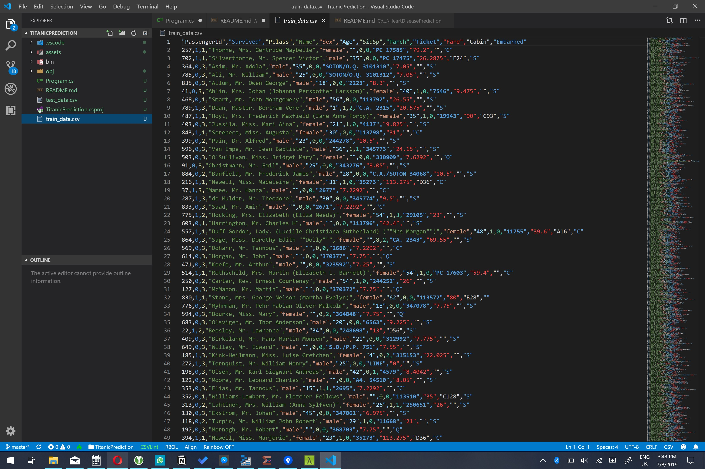

# Assignment: Predict who survived the Titanic disaster

The sinking of the RMS Titanic is one of the most infamous shipwrecks in history. On April 15, 1912, during her maiden voyage, the Titanic sank after colliding with an iceberg, killing 1502 out of 2224 passengers and crew. This sensational tragedy shocked the international community and led to better safety regulations for ships.


In this assignment you're going to build an app that can predict which Titanic passengers survived the disaster. You will use a decision tree classifier to make your predictions.

The first thing you will need for your app is the passenger manifest of the Titanic's last voyage. You will use the famous [Kaggle Titanic Dataset](https://github.com/sbaidachni/MLNETTitanic/tree/master/MLNetTitanic) which has data for a subset of 891 passengers.

Download the [test_data](https://github.com/mdfarragher/DSC/blob/master/BinaryClassification/TitanicPrediction/test_data.csv) and [train_data](https://github.com/mdfarragher/DSC/blob/master/BinaryClassification/TitanicPrediction/train_data.csv) files and save them to your project folder.

The training data file looks like this:



It’s a CSV file with 12 columns of information:

* The passenger identifier
* The label column containing ‘1’ if the passenger survived and ‘0’ if the passenger perished
* The class of travel (1–3)
* The name of the passenger
* The gender of the passenger (‘male’ or ‘female’)
* The age of the passenger, or ‘0’ if the age is unknown
* The number of siblings and/or spouses aboard
* The number of parents and/or children aboard
* The ticket number
* The fare paid
* The cabin number
* The port in which the passenger embarked

The second column is the label: 0 means the passenger perished, and 1 means the passenger survived. All other columns are input features from the passenger manifest.

You're gooing to build a binary classification model that reads in all columns and then predicts for each passenger if he or she survived.

Let’s get started. Here’s how to set up a new console project in NET Core:

```bash
$ dotnet new console -o TitanicPrediction
$ cd TitanicPrediction
```

Next, you need to install the correct NuGet packages:

```
$ dotnet add package Microsoft.ML
$ dotnet add package Microsoft.ML.FastTree
```

Now you are ready to add some classes. You’ll need one to hold passenger data, and one to hold your model predictions.

Modify the Program.cs file like this:

```csharp
using System;
using System.IO;
using System.Linq;
using Microsoft.ML;
using Microsoft.ML.Data;
using Microsoft.ML.Transforms;

namespace TitanicPrediction
{
    /// <summary>
    /// The Passenger class represents one passenger on the Titanic.
    /// </summary>
    public class Passenger
    {
        public bool Label;
        public float Pclass;
        public string Name;
        public string Sex;
        public string RawAge;
        public float SibSp;
        public float Parch;
        public string Ticket;
        public float Fare;
        public string Cabin;
        public string Embarked;
    }

    /// <summary>
    /// The PassengerPrediction class represents one model prediction. 
    /// </summary>
    public class PassengerPrediction
    {
        [ColumnName("PredictedLabel")] public bool Prediction;
        public float Probability;
        public float Score;
    }

    // the rest of the code goes here...
}
```

The **Passenger** class holds one single passenger record. There's also a **PassengerPrediction** class which will hold a single passenger prediction. There's a boolean **Prediction**, a **Probability** value, and the **Score** the model will assign to the prediction.

Now look at the age column in the data file. It's a number, but for some passengers in the manifest the age is not known and the column is empty.

ML.NET can automatically load and process missing numeric values, but only if they are present in the CSV file as a '?'.

The Titanic datafile uses an empty string to denote missing values, so we'll have to perform a feature conversion

Notice how the age is loaded as s string into a Passenger class field called **RawAge**. 

We will process the missing values later in our app. To prepare for this, we'll need two additional helper classes:

```csharp
/// <summary>
/// The RawAge class is a helper class for a column transformation.
/// </summary>
public class FromAge
{
    public string RawAge;
}

/// <summary>
/// The ProcessedAge class is a helper class for a column transformation.
/// </summary>
public class ToAge
{
    public string Age;
}

// the rest of the code goes here...
```

The **FromAge** class contains the 'raw' unprocessed age as a string and the **ToAge** class that contains the processed age. 

Now you're going to load the training data in memory:

```csharp
/// <summary>
/// The main program class.
/// </summary>
public class Program
{
    // filenames for training and test data
    private static string trainingDataPath = Path.Combine(Environment.CurrentDirectory, "train_data.csv");
    private static string testDataPath = Path.Combine(Environment.CurrentDirectory, "test_data.csv");

    /// <summary>
    /// The main application entry point.
    /// </summary>
    /// <param name="args">The command line arguments.</param>
    public static void Main(string[] args)
    {
        // set up a machine learning context
        var mlContext = new MLContext();

        // set up a text loader
        var textLoader = mlContext.Data.CreateTextLoader(
            new TextLoader.Options() 
            {
                Separators = new[] { ',' },
                HasHeader = true,
                AllowQuoting = true,
                Columns = new[] 
                {
                    new TextLoader.Column("Label", DataKind.Boolean, 1),
                    new TextLoader.Column("Pclass", DataKind.Single, 2),
                    new TextLoader.Column("Name", DataKind.String, 3),
                    new TextLoader.Column("Sex", DataKind.String, 4),
                    new TextLoader.Column("RawAge", DataKind.String, 5),  // <-- not a float!
                    new TextLoader.Column("SibSp", DataKind.Single, 6),
                    new TextLoader.Column("Parch", DataKind.Single, 7),
                    new TextLoader.Column("Ticket", DataKind.String, 8),
                    new TextLoader.Column("Fare", DataKind.Single, 9),
                    new TextLoader.Column("Cabin", DataKind.String, 10),
                    new TextLoader.Column("Embarked", DataKind.String, 11)
                }
            }
        );

        // load training and test data
        Console.WriteLine("Loading data...");
        var trainingDataView = textLoader.Load(trainingDataPath);
        var testDataView = textLoader.Load(testDataPath);

        // the rest of the code goes here...
    }
}
```

This code uses the **CreateTextLoader** method to create a CSV data loader. The **TextLoader.Options** class describes how to load each field. Then I call the text loader’s **Load** method twice to load the train- and test data in memory.

ML.NET expects missing data in CSV files to appear as a ‘?’, but unfortunately the Titanic file uses an empty string to indicate an unknown age. So the first thing you need to do is replace all empty age strings occurrences with ‘?’.

We also don't need the Name, Cabin, and Ticket columns to make predictions, so you'll add some code to get rid of them too.

Add the following code:

```csharp
// set up a training pipeline
// step 1: drop the name, cabin, and ticket columns
var pipeline = mlContext.Transforms.DropColumns("Name", "Cabin", "Ticket")

    // step 2: replace missing ages with '?'
    .Append(mlContext.Transforms.CustomMapping<FromAge, ToAge>(
        (inp, outp) => { outp.Age = string.IsNullOrEmpty(inp.RawAge) ? "?" : inp.RawAge; },
        "AgeMapping"
    ))

// the rest of the code goes here...
```

Machine learning models in ML.NET are built with pipelines, which are sequences of data-loading, transformation, and learning components.

The first **DropColumn** component drops the Name, Cabin, and Ticket columns from the dataset. The next **CustomMapping** component converts empty age strings to ‘?’ values.

Now ML.NET is happy with the age values. You will now convert the string ages to numeric values and instruct ML.NET to replace any missing values with the mean age over the entire dataset:

```csharp
// step 3: convert string ages to floats
.Append(mlContext.Transforms.Conversion.ConvertType(
    "Age",
    outputKind: DataKind.Single
))

// step 4: replace missing age values with the mean age
.Append(mlContext.Transforms.ReplaceMissingValues(
    "Age",
    replacementMode: MissingValueReplacingEstimator.ReplacementMode.Mean))

// the rest of the code goes here...
```

The **ConvertType** component converts the Age column to a single-precision floating point value. And the **ReplaceMissingValues** component replaces any missing values with the mean value of all ages in the entire dataset. 

Now let's process the rest of the data columns. The Sex and Embarked columns are enumerations of string values. As you've learned in the Processing Data section, you'll need to one-hot encode them first:

```csharp
// step 5: replace sex and embarked columns with one-hot encoded vectors
.Append(mlContext.Transforms.Categorical.OneHotEncoding("Sex"))
.Append(mlContext.Transforms.Categorical.OneHotEncoding("Embarked"))

// the rest of the code goes here...
```

The **OneHotEncoding** component takes an input column, one-hot encodes all values, and produces a new column with the same name holding the one-hot vectors. 

Now let's wrap up the pipeline:

```csharp
// step 6: concatenate everything into a single feature column 
.Append(mlContext.Transforms.Concatenate(
    "Features", 
    "Age",
    "Pclass", 
    "SibSp",
    "Parch",
    "Sex",
    "Embarked"))

// step 7: use a fasttree trainer
.Append(mlContext.BinaryClassification.Trainers.FastTree(
    labelColumnName: "Label", 
    featureColumnName: "Features"));

// the rest of the code goes here...
```

The **Concatenate** component concatenates all remaining feature columns into a single column for training. This is required because ML.NET can only train on a single input column.

And the **FastTreeBinaryClassificationTrainer** is the algorithm that's going to train the model. You're going to build a decision tree classifier that uses the Fast Tree algorithm to train on the data and configure the tree.

Now all you need to do now is train the model on the entire dataset, compare the predictions with the labels, and compute a bunch of metrics that describe how accurate the model is:

```csharp
// train the model
Console.WriteLine("Training model...");
var trainedModel = pipeline.Fit(trainingDataView);

// make predictions for the test data set
Console.WriteLine("Evaluating model...");
var predictions = trainedModel.Transform(testDataView);

// compare the predictions with the ground truth
var metrics = mlContext.BinaryClassification.Evaluate(
    data: predictions, 
    labelColumnName: "Label", 
    scoreColumnName: "Score");

// report the results
Console.WriteLine($"  Accuracy:          {metrics.Accuracy:P2}");
Console.WriteLine($"  Auc:               {metrics.AreaUnderRocCurve:P2}");
Console.WriteLine($"  Auprc:             {metrics.AreaUnderPrecisionRecallCurve:P2}");
Console.WriteLine($"  F1Score:           {metrics.F1Score:P2}");
Console.WriteLine($"  LogLoss:           {metrics.LogLoss:0.##}");
Console.WriteLine($"  LogLossReduction:  {metrics.LogLossReduction:0.##}");
Console.WriteLine($"  PositivePrecision: {metrics.PositivePrecision:0.##}");
Console.WriteLine($"  PositiveRecall:    {metrics.PositiveRecall:0.##}");
Console.WriteLine($"  NegativePrecision: {metrics.NegativePrecision:0.##}");
Console.WriteLine($"  NegativeRecall:    {metrics.NegativeRecall:0.##}");
Console.WriteLine();

// the rest of the code goes here...
```

This code calls **Fit** to train the model on the entire dataset, **Transform** to set up a prediction for each passenger, and **Evaluate** to compare these predictions to the label and automatically calculate all evaluation metrics:

* **Accuracy**: this is the number of correct predictions divided by the total number of predictions.
* **AreaUnderRocCurve**: a metric that indicates how accurate the model is: 0 = the model is wrong all the time, 0.5 = the model produces random output, 1 = the model is correct all the time. An AUC of 0.8 or higher is considered good.
* **AreaUnderPrecisionRecallCurve**: an alternate AUC metric that performs better for heavily imbalanced datasets with many more negative results than positive.
* **F1Score**: this is a metric that strikes a balance between Precision and Recall. It’s useful for imbalanced datasets with many more negative results than positive.
* **LogLoss**: this is a metric that expresses the size of the error in the predictions the model is making. A logloss of zero means every prediction is correct, and the loss value rises as the model makes more and more mistakes.
* **LogLossReduction**: this metric is also called the Reduction in Information Gain (RIG). It expresses the probability that the model’s predictions are better than random chance.
* **PositivePrecision**: also called ‘Precision’, this is the fraction of positive predictions that are correct. This is a good metric to use when the cost of a false positive prediction is high.
* **PositiveRecall**: also called ‘Recall’, this is the fraction of positive predictions out of all positive cases. This is a good metric to use when the cost of a false negative is high.
* **NegativePrecision**: this is the fraction of negative predictions that are correct.
* **NegativeRecall**: this is the fraction of negative predictions out of all negative cases.

To wrap up, let's have some fun and pretend that I’m going to take a trip on the Titanic too. I will embark in Southampton and pay $70 for a first-class cabin. I travel on my own without parents, children, or my spouse. 

What are my odds of surviving?

Add the following code:

```csharp
// set up a prediction engine
Console.WriteLine("Making a prediction...");
var predictionEngine = mlContext.Model.CreatePredictionEngine<Passenger, PassengerPrediction>(trainedModel);

// create a sample record
var passenger = new Passenger()
{ 
    Pclass = 1,
    Name = "Mark Farragher",
    Sex = "male",
    RawAge = "48",
    SibSp = 0,
    Parch = 0,
    Fare = 70,
    Embarked = "S"
};

// make the prediction
var prediction = predictionEngine.Predict(passenger);

// report the results
Console.WriteLine($"Passenger:   {passenger.Name} ");
Console.WriteLine($"Prediction:  {(prediction.Prediction ? "survived" : "perished" )} ");
Console.WriteLine($"Probability: {prediction.Probability} ");            
```

This code uses the **CreatePredictionEngine** method to set up a prediction engine. The two type arguments are the input data class and the class to hold the prediction. And once the prediction engine is set up, you can simply call **Predict** to make a single prediction.

So would I have survived the Titanic disaster?

Time to find out. Go to your terminal and run your code:

```bash
$ dotnet run
```

What results do you get? What is your accuracy, precision, recall, AUC, AUCPRC, and F1 value?

Is this dataset balanced? Which metrics should you use to evaluate your model? And what do the values say about the accuracy of your model? 

And what about me? Did I survive the disaster?

Do you think a decision tree is a good choice to predict Titanic survivors? Which other algorithms could you use instead? Do they give a better result?

Share your results in our group!
