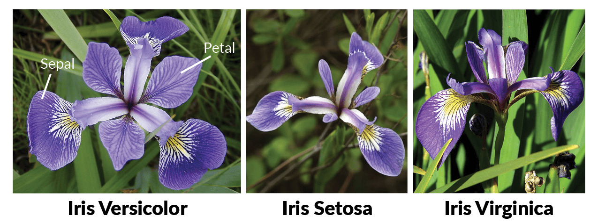

# Assignment: Cluster Iris flowers

In this assignment you are going to build an unsupervised learning app that clusters Iris flowers into discrete groups. 

There are three types of Iris flowers: Versicolor, Setosa, and Virginica. Each flower has two sets of leaves: the inner Petals and the outer Sepals.

Your goal is to build an app that can identify an Iris flower by its sepal and petal size.



Your challenge is that you're not going to use the dataset labels. Your app has to recognize patterns in the dataset and cluster the flowers into three groups without any help. 

Clustering is an example of **unsupervised learning** where the data science model has to figure out the labels on its own. 

The first thing you will need for your app is a data file with Iris flower petal and sepal sizes. You can use this [CSV file](https://github.com/mdfarragher/DSC/blob/master/Clustering/IrisFlower/iris-data.csv). Save it as **iris-data.csv** in your project folder.

The file looks like this:


It’s a CSV file with 5 columns:

* The length of the Sepal in centimeters
* The width of the Sepal in centimeters
* The length of the Petal in centimeters
* The width of the Petal in centimeters
* The type of Iris flower

You are going to build a clustering data science model that reads the data and then guesses the label for each flower in the dataset.

Of course the app won't know the real names of the flowers, so it's just going to number them: 1, 2, and 3.

Let’s get started. You need to build a new application from scratch by opening a terminal and creating a new NET Core console project:

```bash
$ dotnet new console -o IrisFlowers
$ cd IrisFlowers
```

Now install the ML.NET package:

```bash
$ dotnet add package Microsoft.ML
```

Now you are ready to add some classes. You’ll need one to hold a flower and one to hold your model prediction.

Modify the Program.cs file like this:

```csharp
using Microsoft.ML;
using Microsoft.ML.Data;
using System;

namespace IrisFlower
{
    /// <summary>
    /// A data transfer class that holds a single iris flower.
    /// </summary>
    public class IrisData
    {
        [LoadColumn(0)] public float SepalLength;
        [LoadColumn(1)] public float SepalWidth;
        [LoadColumn(2)] public float PetalLength;
        [LoadColumn(3)] public float PetalWidth;
        [LoadColumn(4)] public string Label;
    }

    /// <summary>
    /// A prediction class that holds a single model prediction.
    /// </summary>
    public class IrisPrediction
    {
        [ColumnName("PredictedLabel")]
        public uint ClusterID;

        [ColumnName("Score")]
        public float[] Score;
    }

    // the rest of the code goes here....
}
```

The **IrisData** class holds one single flower. Note how the fields are tagged with the **LoadColumn** attribute that tells ML.NET how to load the data from the data file.

We are loading the label in the 5th column, but we won't be using the label during training because we want the model to figure out the iris flower types on its own.

There's also an **IrisPrediction** class which will hold a prediction for a single flower. The prediction consists of the ID of the cluster that the flower belongs to. Clusters are numbered from 1 upwards. And notice how the score field is an array? Each individual score value represents the distance of the flower to one specific cluster.  

Next you'll need to load the data in memory:

```csharp
/// <summary>
/// The main program class.
/// </summary>
class Program
{
    /// <summary>
    /// The program entry point.
    /// </summary>
    /// <param name="args"The command line arguments></param>
    static void Main(string[] args)
    {
        var mlContext = new MLContext();

        // read the iris flower data from a text file
        var data = mlContext.Data.LoadFromTextFile<IrisData>(
            path: "iris-data.csv", 
            hasHeader: false, 
            separatorChar: ',');

        // split the data into a training and testing partition
        var partitions = mlContext.Data.TrainTestSplit(data, testFraction: 0.2);

    // the rest of the code goes here....
}
```

This code uses the **LoadFromTextFile** method to load the CSV data directly into memory, and then calls **TrainTestSplit** to split the dataset into an 80% training partition and a 20% test partition.

Now let’s build the data science pipeline:

```csharp
// set up a learning pipeline
// step 1: concatenate features into a single column
var pipeline = mlContext.Transforms.Concatenate(
        "Features", 
        "SepalLength", 
        "SepalWidth", 
        "PetalLength", 
        "PetalWidth")

    // step 2: use k-means clustering to find the iris types
    .Append(mlContext.Clustering.Trainers.KMeans(
        featureColumnName: "Features",
        numberOfClusters: 3));

// train the model on the data file
Console.WriteLine("Start training model....");
var model = pipeline.Fit(partitions.TrainSet);
Console.WriteLine("Model training complete!");

// the rest of the code goes here...
```

Machine learning models in ML.NET are built with pipelines, which are sequences of data-loading, transformation, and learning components.

This pipeline has two components:

* **Concatenate** which converts the PixelValue vector into a single column called Features. This is a required step because ML.NET can only train on a single input column.
* A **KMeans** component which performs K-Means Clustering on the data and tries to find all Iris flower types. 

With the pipeline fully assembled, the code trains the model with a call to **Fit**.

You now have a fully- trained model. So now it's time to take the test set, predict the type of each flower, and calculate the accuracy metrics of the model:

```csharp
// evaluate the model
Console.WriteLine("Evaluating model:");
var predictions = model.Transform(partitions.TestSet);
var metrics = mlContext.Clustering.Evaluate(
    predictions, 
    scoreColumnName: "Score", 
    featureColumnName: "Features");
Console.WriteLine($"   Average distance:       {metrics.AverageDistance}");
Console.WriteLine($"   Davies Bouldin index:     {metrics.DaviesBouldinIndex}");

// the rest of the code goes here....
```

This code calls **Transform** to set up predictions for every flower in the test set, and **Evaluate** to evaluate the predictions and automatically calculates two metrics:

* **AverageDistance**: this is the average distance of a flower to the center point of its cluster, averaged over all clusters in the dataset. It is a measure for the 'tightness' of the clusters. Lower values are better and mean more concentrated clusters. 
* **DaviesBouldinIndex**: this metric is the average 'similarity' of each cluster with its most similar cluster. Similarity is defined as the ratio of within-cluster distances to between-cluster distances. So in other words, clusters which are farther apart and more concentrated will result in a better score. Low values indicate better clustering.

So Average Distance measures how concentrated the clusters are in the dataset, and the Davies Bouldin Index measures both concentration and how far apart the clusters are spaced. Both metrics are negative-based with zero being the perfect score.

To wrap up, let’s use the model to make predictions.

You will pick three arbitrary flowers from the test set, run them through the model, and compare the predictions with the labels provided in the data file.

Here’s how to do it:

```csharp
// show predictions for a couple of flowers
Console.WriteLine("Predicting 3 flowers from the test set....");
var flowers = mlContext.Data.CreateEnumerable<IrisData>(partitions.TestSet, reuseRowObject: false).ToArray();
var flowerPredictions = mlContext.Data.CreateEnumerable<IrisPrediction>(predictions, reuseRowObject: false).ToArray();
foreach (var i in new int[] { 0, 10, 20 })
{
    Console.WriteLine($"   Flower: {flowers[i].Label}, prediction: {flowerPredictions[i].ClusterID}");
}
```

This code calls the **CreateEnumerable** method to convert the test partition into an array of **IrisData** instances, and the model predictions into an array of **IrisPrediction** instances. 

Then the code picks three flowers for testing. For each flower it writes the label and the cluster ID (= a number between 1 and 3) to the console. 

That's it, you're done!

Go to your terminal and run your code:

```bash
$ dotnet run
```

What results do you get? What is your average distance and your davies bouldin index? 

What do you think this says about the quality of the clusters?

What did the 3 flower predictions look like? Does the cluster prediction match the label every time? 

Now change the code and check the predictions for every flower. How often does the model get it wrong? Which Iris types are the most confusing to the model?
