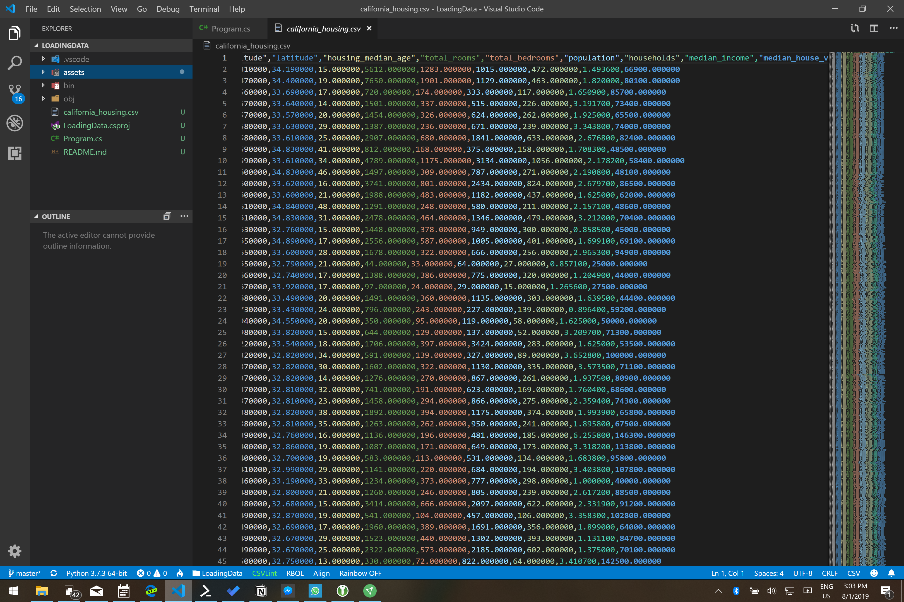
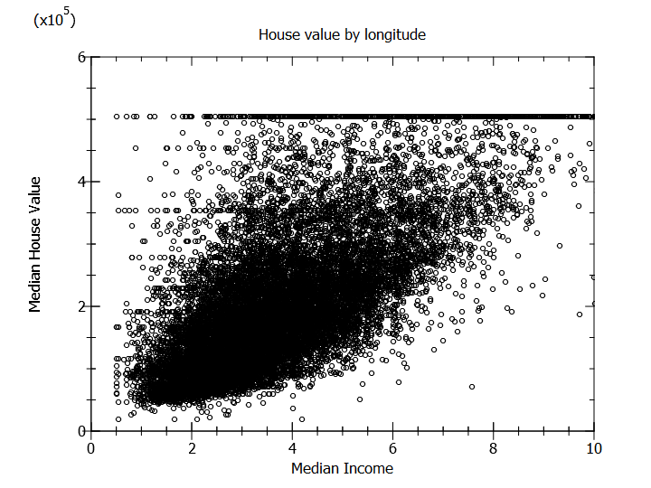

# Assignment: Load California housing data

In this assignment you're going to build an app that can load a dataset with the prices of houses in California. The data is not ready for training yet and needs a bit of processing. 

The first thing you'll need is a data file with house prices. The data from the 1990 California cencus has exactly what we need. 

Download the [California 1990 housing census](https://github.com/mdfarragher/DSC/blob/master/LoadingData/CaliforniaHousing/california_housing.csv) and save it as **california_housing.csv**. 

This is a CSV file with 17,000 records that looks like this:



The file contains information on 17k housing blocks all over the state of California:

* Column 1: The longitude of the housing block
* Column 2: The latitude of the housing block
* Column 3: The median age of all the houses in the block
* Column 4: The total number of rooms in all houses in the block
* Column 5: The total number of bedrooms in all houses in the block
* Column 6: The total number of people living in all houses in the block
* Column 7: The total number of households in all houses in the block
* Column 8: The median income of all people living in all houses in the block
* Column 9: The median house value for all houses in the block

We can use this data to train an app to predict the value of any house in and outside the state of California. 

Unfortunately we cannot train on this dataset directly. The data needs to be processed first to make it suitable for training. This is what you will do in this assignment. 

Let's get started. 

In these assignments you will not be using the code in Github. Instead, you'll be building all the applications 100% from scratch. So please make sure to create a new folder somewhere to hold all of your assignments.

Now please open a console window. You are going to create a new subfolder for this assignment and set up a blank console application:

```bash
$ dotnet new console -o LoadingData
$ cd LoadingData
```

Also make sure to copy the dataset file(s) into this folder because the code you're going to type next will expect them here.  

Now install the following packages

```bash
$ dotnet add package Microsoft.ML
$ dotnet add package BetterConsoleTables
$ dotnet add package plplot
```

**Microsoft.ML** is the Microsoft machine learning package. We will use to build all our applications in this course. The **BetterConsoleTables** package is a handy library for writing nicely formatted tables to the console. ANd **PLplot** is an advanced scientific plotting library.

Now you are ready to add classes. You’ll need one class to hold all the information for a single housing block.

Edit the Program.cs file with Visual Studio Code and add the following code:

```csharp
using System;
using System.IO;
using System.Linq;
using Microsoft.ML;
using Microsoft.ML.Data;
using BetterConsoleTables;
using PLplot;

namespace LoadingData
{
    /// <summary>
    /// The HouseBlockData class holds one single housing block data record.
    /// </summary>
    public class HouseBlockData
    {
        [LoadColumn(0)] public float Longitude { get; set; }
        [LoadColumn(1)] public float Latitude { get; set; }
        [LoadColumn(2)] public float HousingMedianAge { get; set; }
        [LoadColumn(3)] public float TotalRooms { get; set; }
        [LoadColumn(4)] public float TotalBedrooms { get; set; }
        [LoadColumn(5)] public float Population { get; set; }
        [LoadColumn(6)] public float Households { get; set; }
        [LoadColumn(7)] public float MedianIncome { get; set; }
        [LoadColumn(8)] public float MedianHouseValue { get; set; }
    }

    // the rest of the code goes here...
}
```

The **HouseBlockData** class holds all the data for one single housing block. Note how each field is tagged with a **LoadColumn** attribute that will tell the CSV data loading code which column to import data from.

Now you need to load the data in memory:

```csharp
/// <summary>
/// The main program class.
/// </summary>
class Program
{
    // filename for data set
    private static string dataPath = Path.Combine(Environment.CurrentDirectory, "california_housing.csv");
    
    /// <summary>
    /// The main program entry point.
    /// </summary>
    /// <param name="args">The command line arguments</param>
    static void Main(string[] args)
    {
        // create the machine learning context
        var context = new MLContext();

        // load the dataset
        Console.WriteLine("Loading data...");
        var data = context.Data.LoadFromTextFile<HouseBlockData>(
            path: dataPath, 
            hasHeader:true, 
            separatorChar: ',');

        // the rest of the code goes here...
    }
}
```

This code calls the **LoadFromTextFile** method to load the CSV data in memory. Note the **HouseBlockData** type argument that tells the method which class to use to load the data.

So now we have the data in memory. Let's plot the median house value as a function of median income and see what happens. 

Add the following code:

```csharp
// get an array of housing data
var houses = context.Data.CreateEnumerable<HouseBlockData>(data, reuseRowObject: false).ToArray();

// plot median house value by longitude
var pl = new PLStream();
pl.sdev("pngcairo");                // png rendering
pl.sfnam("data.png");               // output filename
pl.spal0("cmap0_alternate.pal");    // alternate color palette
pl.init();
pl.env(
    0, 10,                          // x-axis range
    0, 600000,                      // y-axis range
    AxesScale.Independent,          // scale x and y independently
    AxisBox.BoxTicksLabelsAxes);    // draw box, ticks, and num ticks
pl.lab(
    "Median Income",                // x-axis label
    "Median House Value",           // y-axis label
    "House value by longitude");    // plot title
pl.sym(
    houses.Select(h => (double)h.MedianIncome).ToArray(),
    houses.Select(h => (double)h.MedianHouseValue).ToArray(),
    (char)218
);
pl.eop();

// the rest of the code goes here
```

The housing data is  stored in memory as a data view, but we want to work with the **HouseBlockData** records directly. So we call **CreateEnumerable** to convert the data view to an enumeration of **HouseDataBlock** instances.

The **pl.sdev** method then sets the plot device and the **sfnam** method sets the output filename. We call **spal0** to set an alternate color palette, **init** to initialize the plot, **env** to set up the axes, and **lab** to set up the labels.

The **sym** method draws a symbol for every houseing block in the dataset. The code uses two LINQ queries to set up arrays of median income and median house values.

The final **eop** method closes the plot and saves it to disk.

This is a good moment to save your work ;) 

We're ready to run the app. But first we need to make sure that the **Plplot** library is available. 

If you're using a Linux system, please type the following:

```bash
$ sudo apt-get install libplplot15
$ sudo apt-get install plplot-driver-cairo
```

This will install Plplot on your system with an output driver for rendering PNG images.

If you're on Windows, all the Plplot installation files are already present in the Nuget package. But we have to do a housekeeping task. There's an unfortunate bug in the Plplot library that makes it look in the wrong folder for font and color palette files.  We need to copy these files to a different location to get the library to work. 

Open a Powershell terminal and make sure you're in the project folder. Then type the following: 

```bash
$ dotnet build
```

This will build the project and populate the bin folder. The Plplot library files are now present in the bin folder, but the font and color palette files have been placed in the wrong folder. We're going to fix that now. 

Please type the following:

```bash
$ cd .\bin\Debug\netcoreapp3.0\
$ copy .\runtimes\win-x64\native\plplot . -recurse
$ cd ..\..\..
```

This copies the subfolder with all the font and color files into the folder of the executing assembly where the Plplot library can find it. 

That's it, you're now ready to run the app on the console in either Linux or Windows. 

Type the following:

```bash
$ dotnet run
```

Your app will run and write the plot to a new image file called **data.png**. It should look like this:



As the median income level increases, the median house value also increases. There's still a big spread in the house values, but a vague 'cigar' shape is visible which suggests a linear relationship between these two variables.

But look at the horizontal line at 500,000. What's that all about? 

This is what **clipping** looks like. The creator of this dataset has clipped all housing blocks with a median house value above $500,000 back down to $500,000. We see this appear in the graph as a horizontal line that disrupts the linear 'cigar' shape. 

Let's start by using **data scrubbing** to get rid of these clipped records. Add the following code:

```csharp
// keep only records with a median house value <= 500,000
data = context.Data.FilterRowsByColumn(
    data,
    "MedianHouseValue",
    upperBound: 500_000
);

// the rest of the code goes here...
```

The **FilterRowsByColumn** method will keep only those records with a median house value of 500,000 or less, and remove all other records from the dataset.  

Move your plotting code BELOW this code fragment and run your app again. 

Did this fix the problem? Is the clipping line gone?

Now let's take a closer look at the CSV file. Notice how all the columns are numbers in the range of 0..3000, but the median house value is in a range of 0..500,000. 

Remember when we talked about training data science models that we discussed having all data in a similar range?

So let's fix that now by using **data scaling**. We're going to divide the median house value by 1,000 to bring it down to a range more in line with the other data columns. 

Start by adding the following class:

```csharp
/// <summary>
/// The ToMedianHouseValue class is used in a column data conversion.
/// </summary>
public class ToMedianHouseValue
{
    public float NormalizedMedianHouseValue { get; set; }
}
```

And then add the following code at the bottom of your **Main** method:

```csharp
// build a data loading pipeline
// step 1: divide the median house value by 1000
var pipeline = context.Transforms.CustomMapping<HouseBlockData, ToMedianHouseValue>(
    (input, output) => { output.NormalizedMedianHouseValue = input.MedianHouseValue / 1000; },
    contractName: "MedianHouseValue"
);

// the rest of the code goes here...
```

Machine learning models in ML.NET are built with pipelines which are sequences of data-loading, transformation, and learning components.

This pipeline has only one component:

* **CustomMapping** which takes the median house values, divides them by 1,000 and stores them in a new column called **NormalizedMedianHouseValue**. Note that we need the new **ToMedianHouseValue** class to access this new column in code. 

Let's see if the conversion worked. Add the following helper method to the top of the **Program** class:

```csharp
/// <summary>
/// Helper method to write the machine learning pipeline to the console.
/// </summary>
/// <param name="preview">The data preview to write.</param>
public static void WritePreview(DataDebuggerPreview preview)
{
    // set up a console table
    var table = new Table(
        TableConfiguration.Unicode(),
        (from c in preview.ColumnView 
            select new ColumnHeader(c.Column.Name)).ToArray());

    // fill the table with results
    foreach (var row in preview.RowView)
    {
        table.AddRow((from c in row.Values 
                        select c.Value is VBuffer<float> ? "<vector>" : c.Value
                    ).ToArray());
    }

    // write the table
    Console.WriteLine(table.ToString());
}
```

The **WritePreview** method uses the **Table** class from the **BetterConsoleTables** package to write the contents of the **preview** argument to the console. 

So let's generate this preview now. Add the following code at the bottom of the **Main** method:

```csharp
// get a 10-record preview of the transformed data
var model = pipeline.Fit(data);
var transformedData = model.Transform(data);
var preview = transformedData.Preview(maxRows: 10);

// show the preview
WritePreview(preview);

// the rest of the code goes here...
```

The **Fit** method sets up the pipeline, creates a data science model and stores it in the **model** variable. The **Transform** method then runs the dataset through the pipeline and stores the result in **transformedData**. And finally the **Preview** method extracts a 10-row preview from the transformed data.

We then call the new **WritePreview** method to write these 10 records to the console. 

Now run your code. 

Find the MedianHouseValue and NormalizedMedianHouseValue columns in the output. Do they contain the correct values? Does the normalized column contain the oroginal house values divided by 1,000? 

Now let's fix the latitude and longitude. We're reading them in directly, but remember that we discussed how **Geo data should always be binned, one-hot encoded, and crossed?** 

Let's do that now. Add the following classes at the top of the namespace:

```csharp
/// <summary>
/// The FromLocation class is used in a column data conversion.
/// </summary>
public class FromLocation
{
    public float[] EncodedLongitude { get; set; }
    public float[] EncodedLatitude { get; set; }
}

/// <summary>
/// The ToLocation class is used in a column data conversion.
/// </summary>
public class ToLocation
{
    public float[] Location { get; set; }
}

```

We're going to use these classes in the next code snippet.

Now scroll down to the bottom of the **Main** method and add the following code after step 1:

```csharp
// step 2: bin the longitude
var pipeline2 = pipeline.Append(context.Transforms.NormalizeBinning(
        inputColumnName: "Longitude",
        outputColumnName: "BinnedLongitude",
        maximumBinCount: 10
    ))

    // step 3: bin the latitude
    .Append(context.Transforms.NormalizeBinning(
        inputColumnName: "Latitude",
        outputColumnName: "BinnedLatitude",
        maximumBinCount: 10
    ))

    // step 4: one-hot encode the longitude
    .Append(context.Transforms.Categorical.OneHotEncoding(
        inputColumnName: "BinnedLongitude",
        outputColumnName: "EncodedLongitude"
    ))

    // step 5: one-hot encode the latitude
    .Append(context.Transforms.Categorical.OneHotEncoding(
        inputColumnName: "BinnedLatitude",
        outputColumnName: "EncodedLatitude"
    ));

// the rest of the code goes here...
```

Note how we're extending the data loading pipeline with extra components. The new components are:

* Two **NormalizeBinning** components that bin the longitude and latitude values into 10 bins

* Two **OneHotEncoding** components that one-hot encode the longitude and latitude bins

So now we're almost done. All we need to do next is cross the longitude and latitude one-hot vectors. We'll also add an extra component to remove all the columns from the dataset we no longer need: 

```csharp
// step 6: cross the two one-hot encoded columns
var pipeline3 = pipeline2.Append(context.Transforms.CustomMapping<FromLocation, ToLocation>(
    (input, output) => { 
        output.Location = new float[input.EncodedLongitude.Length * input.EncodedLatitude.Length];
        var index = 0;
        for (var i = 0; i < input.EncodedLongitude.Length; i++)
            for (var j = 0; j < input.EncodedLatitude.Length; j++)
                output.Location[index++] = input.EncodedLongitude[i] * input.EncodedLatitude[j];
    },
    contractName: "Location"
))

// step 7: remove all the columns we don't need anymore
.Append(context.Transforms.DropColumns(
    "MedianHouseValue",
    "Longitude",
    "Latitude",
    "BinnedLongitude",
    "BinnedLatitude",
    "EncodedLongitude",
    "EncodedLatitude"
));

// the rest of the code goes here...
```

This code extendes the pipeline with two additional components:

* A **CustomMapping** component that crosses the one-hot encoded vectors of the longitude and latitude. ML.NET has no built-in support for crossing one-hot encoded vectors, so we do it manually with a nested for loop and store the result in a new column called **Location**.

* A final **DropColumns** component to delete all columns from the data view that we don't need anymore. 

Let's see if this worked. 

Remember that code you added to preview the pipeline and write the first 10 records to the console? Look up that code now (including the part that calls **Fit**, **Transform** and **Preview**) and move it to the bottom of your **Main** method. 

Don't forget to edit the code so that it previews **pipeline3**.  

It should look like this:

```csharp
// get a 10-record preview of the transformed data
var model = pipeline3.Fit(data);
var transformedData = model.Transform(data);
var preview = transformedData.Preview(maxRows: 10);

// show the preview
WritePreview(preview);
```

Now run your app. 

What does the data look like now? Is the list of columns correct? Are all the dropped columns gone? And is the new **Location** column present?

You should see the new **Location** column, but the **WritePreview** method can't display it's contents. It just prints '\<vector\>' instead. 

So let's fix that. Add the following helper method at the top of the **Program** class:

```csharp
/// <summary>
/// Helper method to write a single column preview to the console.
/// </summary>
/// <param name="preview">The data preview to write.</param>
/// <param name="column">The name of the column to write.</param>
public static void WritePreviewColumn(DataDebuggerPreview preview, string column)
{
    // set up a console table
    var table = new Table(TableConfiguration.Unicode(), new ColumnHeader(column));

    // fill the table with results
    foreach (var row in preview.RowView)
    {
        foreach (var col in row.Values)
        {
            if (col.Key == column)
            {   
                var vector = (VBuffer<float>)col.Value;
                table.AddRow(string.Concat(vector.DenseValues()));
            }
        }
    }

    // write the table
    Console.WriteLine(table.ToString());
}
```

This is a modified helper method that can display a single one-hot encoded column as a string of zeroes and ones.

Now go back to the end of your **Main** method and replace the final line with this:

```csharp
WritePreviewColumn(preview, "Location");
```

Now run your app. What do you see? Did it work? Are there 100 digits in the **Location** column? And is there only a single '1' digit in each row? 

Post your results in our group. 