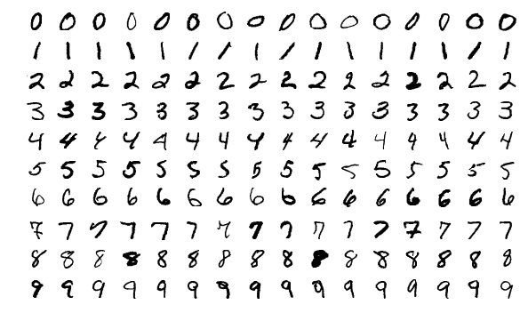
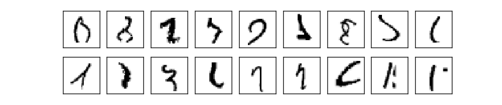
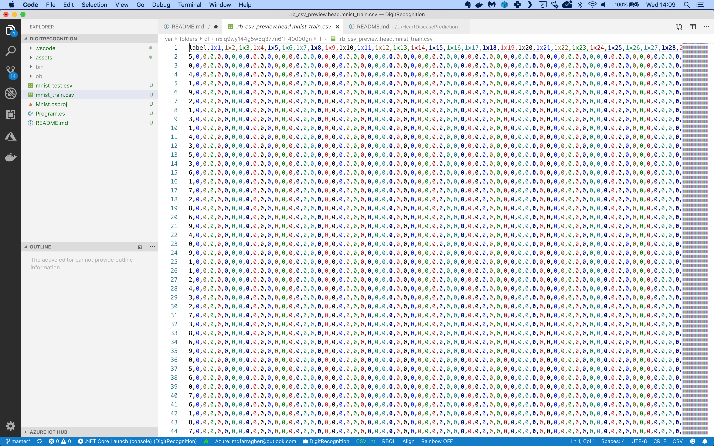

# Assignment: Recognize handwritten digits

In this article, You are going to build an app that recognizes handwritten digits from the famous MNIST machine learning dataset:



Your app must read these images of handwritten digits and correctly predict which digit is visible in each image.

This may seem like an easy challenge, but look at this:



These are a couple of digits from the dataset. Are you able to identify each one? It probably won’t surprise you to hear that the human error rate on this exercise is around 2.5%.

The first thing you will need for your app is a data file with images of handwritten digits. We will not use the original MNIST data because it's stored in a nonstandard binary format.

Instead, we'll use these excellent [CSV files](https://www.kaggle.com/oddrationale/mnist-in-csv/) prepared by Daniel Dato on Kaggle.

Create a Kaggle account if you don't have one yet, then download **mnist_train.csv** and **mnist_test.csv** and save them in your project folder.

There are 60,000 images in the training file and 10,000 in the test file. Each image is monochrome and resized to 28x28 pixels.

The training file looks like this:



It’s a CSV file with 785 columns:

* The first column contains the label. It tells us which one of the 10 possible digits is visible in the image.
* The next 784 columns are the pixel intensity values (0..255) for each pixel in the image, counting from left to right and top to bottom.

You are going to build a multiclass classification machine learning model that reads in all 785 columns, and then makes a prediction for each digit in the dataset.

Let’s get started. You need to build a new application from scratch by opening a terminal and creating a new NET Core console project:

```bash
$ dotnet new console -o Mnist
$ cd Mnist
```

Now install the following ML.NET packages:

```bash
$ dotnet add package Microsoft.ML
$ dotnet add package BetterConsoleTables
```

**BetterConsoleTables** is a package that will help you output tabular data in a nice format to the console. 

Now you are ready to add some classes. You’ll need one to hold a digit, and one to hold your model prediction.

Modify the Program.cs file like this:

```csharp
using System;
using System.IO;
using System.Linq;
using Microsoft.ML;
using Microsoft.ML.Data;
using Microsoft.ML.Transforms;
using BetterConsoleTables;

namespace Mnist
{
    /// <summary>
    /// The Digit class represents one mnist digit.
    /// </summary>
    class Digit
    {
        [ColumnName("PixelValues")]
        [VectorType(784)]
        public float[] PixelValues;

        [LoadColumn(0)]
        public float Number;
    }

    /// <summary>
    /// The DigitPrediction class represents one digit prediction.
    /// </summary>
    class DigitPrediction
    {
        [ColumnName("Score")]
        public float[] Score;
    }

    // the rest of the code goes here....
}
```

The Digit class holds one single MNIST digit image. Note how the field is tagged with a VectorType attribute. This tells ML.NET to combine the 784 individual pixel columns into a single vector value.

There's also a DigitPrediction class which will hold a single prediction. And notice how the prediction score is actually an array? The model will generate 10 scores, one for every possible digit value. 

Next you'll need to load the data in memory:

```csharp
/// <summary>
/// The main program class.
/// </summary>
class Program
{
    // filenames for data set
    private static string trainDataPath = Path.Combine(Environment.CurrentDirectory, "mnist_train.csv");
    private static string testDataPath = Path.Combine(Environment.CurrentDirectory, "mnist_test.csv");

    /// <summary>
    /// The program entry point.
    /// </summary>
    /// <param name="args">The command line arguments.</param>
    static void Main(string[] args)
    {
        // create a machine learning context
        var context = new MLContext();

        // load data
        Console.WriteLine("Loading data....");
        var columnDef = new TextLoader.Column[]
        {
            new TextLoader.Column(nameof(Digit.PixelValues), DataKind.Single, 1, 784),
            new TextLoader.Column("Number", DataKind.Single, 0)
        };
        var trainDataView = context.Data.LoadFromTextFile(
            path: trainDataPath,
            columns : columnDef,
            hasHeader : true,
            separatorChar : ',');
        var testDataView = context.Data.LoadFromTextFile(
            path: testDataPath,
            columns : columnDef,
            hasHeader : true,
            separatorChar : ',');

        // the rest of the code goes here....
    }
}
```

This code uses the **LoadFromTextFile** method to load the CSV data directly into memory. Note the **columnDef** variable that instructs ML.NET to load CSV columns 1..784 into the PixelValues column, and CSV column 0 into the Number column.

Now let’s build the machine learning pipeline:

```csharp
// build a training pipeline
// step 1: map the number column to a key value and store in the label column
var pipeline = context.Transforms.Conversion.MapValueToKey(
    outputColumnName: "Label", 
    inputColumnName: "Number", 
    keyOrdinality: ValueToKeyMappingEstimator.KeyOrdinality.ByValue)

    // step 2: concatenate all feature columns
    .Append(context.Transforms.Concatenate(
        "Features", 
        nameof(Digit.PixelValues)))
        
    // step 3: cache data to speed up training                
    .AppendCacheCheckpoint(context)

    // step 4: train the model with SDCA
    .Append(context.MulticlassClassification.Trainers.SdcaMaximumEntropy(
        labelColumnName: "Label", 
        featureColumnName: "Features"))

    // step 5: map the label key value back to a number
    .Append(context.Transforms.Conversion.MapKeyToValue(
        outputColumnName: "Number",
        inputColumnName: "Label"));

// train the model
Console.WriteLine("Training model....");
var model = pipeline.Fit(trainDataView);

// the rest of the code goes here....
```

Machine learning models in ML.NET are built with pipelines, which are sequences of data-loading, transformation, and learning components.

This pipeline has the following components:

* **MapValueToKey** which reads the **Number** column and builds a dictionary of unique values. It then produces an output column called **Label** which contains the dictionary key for each number value. We need this step because we can only train a multiclass classifier on keys. 
* **Concatenate** which converts the PixelValue vector into a single column called Features. This is a required step because ML.NET can only train on a single input column.
* **AppendCacheCheckpoint** which caches all training data at this point. This is an optimization step that speeds up the learning algorithm which comes next.
* A **SdcaMaximumEntropy** classification learner which will train the model to make accurate predictions.
* A final **MapKeyToValue** step which converts the keys in the **Label** column back to the original number values. We need this step to show the numbers when making predictions. 

With the pipeline fully assembled, you can train the model with a call to **Fit**.

You now have a fully- trained model. So now it's time to take the test set, predict the number for each digit image, and calculate the accuracy metrics of the model:

```csharp
// use the model to make predictions on the test data
Console.WriteLine("Evaluating model....");
var predictions = model.Transform(testDataView);

// evaluate the predictions
var metrics = context.MulticlassClassification.Evaluate(
    data: predictions, 
    labelColumnName: "Number", 
    scoreColumnName: "Score");

// show evaluation metrics
Console.WriteLine($"Evaluation metrics");
Console.WriteLine($"    MicroAccuracy:    {metrics.MicroAccuracy:0.###}");
Console.WriteLine($"    MacroAccuracy:    {metrics.MacroAccuracy:0.###}");
Console.WriteLine($"    LogLoss:          {metrics.LogLoss:#.###}");
Console.WriteLine($"    LogLossReduction: {metrics.LogLossReduction:#.###}");
Console.WriteLine();

// the rest of the code goes here....
```

This code calls **Transform** to set up predictions for every single image in the test set. And the **Evaluate** method compares these predictions to the actual labels and automatically calculates four metrics:

* **MicroAccuracy**: this is the average accuracy (=the number of correct predictions divided by the total number of predictions) for every digit in the dataset.
* **MacroAccuracy**: this is calculated by first calculating the average accuracy for each unique prediction value, and then taking the averages of those averages.
* **LogLoss**: this is a metric that expresses the size of the error in the predictions the model is making. A logloss of zero means every prediction is correct, and the loss value rises as the model makes more and more mistakes.
* **LogLossReduction**: this metric is also called the Reduction in Information Gain (RIG). It expresses the probability that the model’s predictions are better than random chance.

We can compare the micro- and macro accuracy to discover if the dataset is biased. In an unbiased set each unique label value will appear roughly the same number of times, and the micro- and macro accuracy values will be close together.

If the values are far apart, this suggests that there is some kind of bias in the data that we need to deal with. 

To wrap up, let’s use the model to make a prediction.

You will pick five arbitrary digits from the test set, run them through the model, and make a prediction for each one.

Here’s how to do it:

```csharp
// grab three digits from the test data
var digits = context.Data.CreateEnumerable<Digit>(testDataView, reuseRowObject: false).ToArray();
var testDigits = new Digit[] { digits[5], digits[16], digits[28], digits[63], digits[129] };

// create a prediction engine
var engine = context.Model.CreatePredictionEngine<Digit, DigitPrediction>(model);

// set up a table to show the predictions
var table = new Table(TableConfiguration.Unicode());
table.AddColumn("Digit");
for (var i = 0; i < 10; i++)
    table.AddColumn($"P{i}");

// predict each test digit
for (var i=0; i < testDigits.Length; i++)
{
    var prediction = engine.Predict(testDigits[i]);
    table.AddRow(
        testDigits[i].Number, 
        prediction.Score[0].ToString("P2"),
        prediction.Score[1].ToString("P2"),
        prediction.Score[2].ToString("P2"),
        prediction.Score[3].ToString("P2"),
        prediction.Score[4].ToString("P2"),
        prediction.Score[5].ToString("P2"),
        prediction.Score[6].ToString("P2"),
        prediction.Score[7].ToString("P2"),
        prediction.Score[8].ToString("P2"),
        prediction.Score[9].ToString("P2"));
}

// show results
Console.WriteLine(table.ToString());
```

This code calls the **CreateEnumerable** method to convert the test dataview to an array of Digit instances. Then it picks five random digits for testing.

The **CreatePredictionEngine** method sets up a prediction engine. The two type arguments are the input data class and the class to hold the prediction.

The code then prepares a **Table** from the **BetterConsoleTables** package to present the output in a nice tabular format. 

And finally, the code makes a prediction by calling **Predict** and fills a new table row with the digit label and the 10 prediction scores for each possible result. 

That's it, you're done!

Go to your terminal and run your code:

```bash
$ dotnet run
```

What results do you get? What are your micro- and macro accuracy values? Which logloss and logloss reduction did you get?

Do you think the dataset is biased? 

What can you say about the accuracy? Is this a good model? How far away are you from the human accuracy rate? Is this a superhuman or subhuman AI? 

What did the 5 digit predictions look like? Do you understand why the model gets confused sometimes? 

Think about the code in this assignment. How could you improve the accuracy of the model even further?

Share your results in our group!
