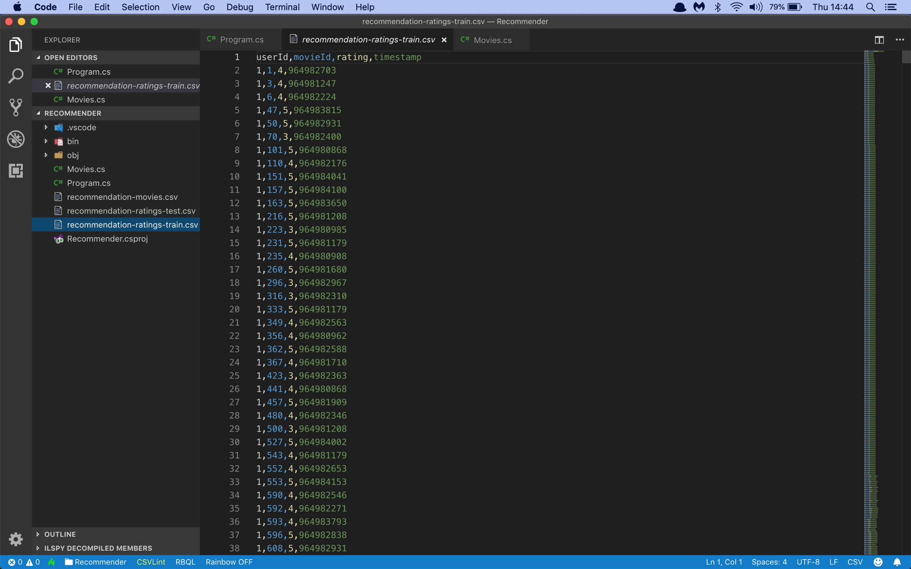
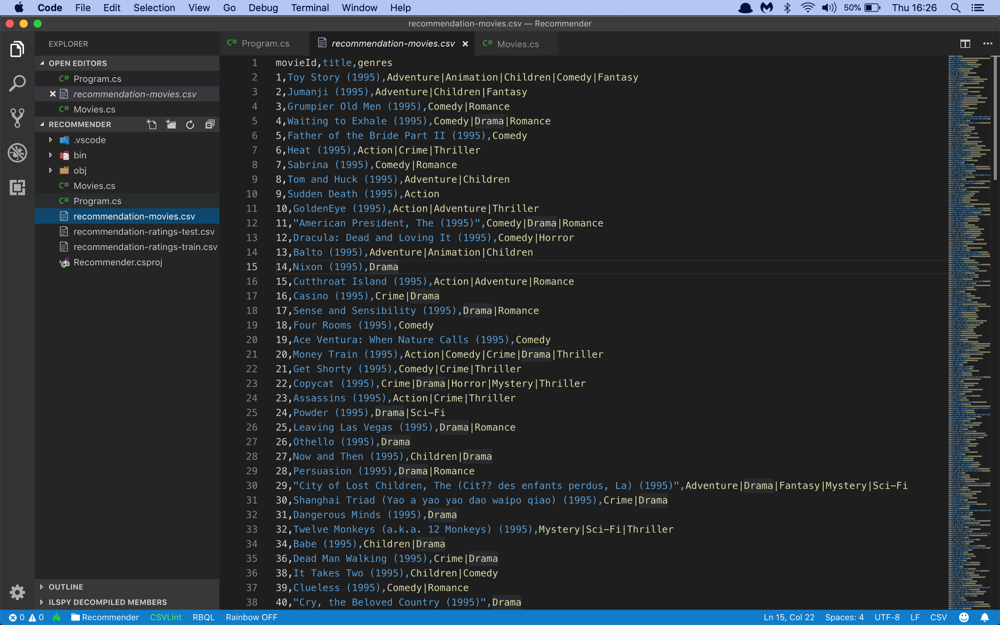

# Assignment: Recommend new movies to film fans

In this assignment you're going to build a movie recommendation system that can recommend new movies to film fans.

The first thing you'll need is a data file with thousands of movies rated by many different users. The [MovieLens Project](https://movielens.org) has exactly what you need.

Download the [movie ratings for training](https://github.com/mdfarragher/DSC/blob/master/Recommendation/MovieRecommender/recommendation-ratings-train.csv), [movie ratings for testing](https://github.com/mdfarragher/DSC/blob/master/Recommendation/MovieRecommender/recommendation-ratings-test.csv), and the [movie dictionary](https://github.com/mdfarragher/DSC/blob/master/Recommendation/MovieRecommender/recommendation-movies.csv) and save these files in your project folder. You now have 100,000 movie ratings with 99,980 set aside for training and 20 for testing. 

The training and testing files are in CSV format and look like this:




There are only four columns of data:

* The ID of the user
* The ID of the movie
* The movie rating on a scale from 1–5
* The timestamp of the rating

There's also a movie dictionary in CSV format with all the movie IDs and titles:




You are going to build a data science model that reads in each user ID, movie ID, and rating, and then predicts the ratings each user would give for every movie in the dataset.

Once you have a fully trained model, you can easily add a new user with a couple of favorite movies and then ask the model to generate predictions for any of the other movies in the dataset.

And in fact this is exactly how the recommendation systems on Netflix and Amazon work. 

Let's get started. You need to build a new application from scratch by opening a terminal and creating a new NET Core console project:

```bash
$ dotnet new console -o MovieRecommender
$ cd MovieRecommender
```

Now install the following packages

```bash
$ dotnet add package Microsoft.ML
$ dotnet add package Microsoft.ML.Recommender
```

Now you're ready to add some classes. You will need one class to hold a movie rating, and one to hold your model’s predictions.

Edit the Program.cs file with Visual Studio Code and add the following code:

```csharp
using System;
using System.IO;
using System.Linq;
using Microsoft.ML;
using Microsoft.ML.Trainers;
using Microsoft.ML.Data;

namespace MovieRecommender
{
    /// <summary>
    /// The MovieRating class holds a single movie rating.
    /// </summary>
    public class MovieRating
    {
        [LoadColumn(0)] public float UserID;
        [LoadColumn(1)] public float MovieID;
        [LoadColumn(2)] public float Label;
    }

    /// <summary>
    /// The MovieRatingPrediction class holds a single movie prediction.
    /// </summary>
    public class MovieRatingPrediction
    {
        public float Label;
        public float Score;
    }

    // the rest of the code goes here...
}
```

The **MovieRating** class holds one single movie rating. Note how each field is tagged with a **LoadColumn** attribute that tell the CSV data loading code which column to import data from.

You're also declaring a **MovieRatingPrediction** class which will hold a single movie rating prediction.

Now you need to load the training data in memory:

```csharp
    /// <summary>
    /// The main program class.
    /// </summary>
    class Program
    {
        // filenames for training and test data
        private static string trainingDataPath = Path.Combine(Environment.CurrentDirectory, "recommendation-ratings-train.csv");
        private static string testDataPath = Path.Combine(Environment.CurrentDirectory, "recommendation-ratings-test.csv");

        /// <summary>
        /// The program entry point.
        /// </summary>
        /// <param name="args">The command line arguments</param>
        static void Main(string[] args)
        {
            // set up a new machine learning context
            var context = new MLContext();

            // load training and test data
            var trainingDataView = context.Data.LoadFromTextFile<MovieRating>(trainingDataPath, hasHeader: true, separatorChar: ',');
            var testDataView = context.Data.LoadFromTextFile<MovieRating>(testDataPath, hasHeader: true, separatorChar: ',');

            // the rest of the code goes here...
        }
    }
}
```

This code uses the method **LoadFromTextFile** to load the CSV data directly into memory. The class field annotations tell the method how to store the loaded data in the **MovieRating** class.

Now you're ready to start building the machine learning model:

```csharp
// prepare matrix factorization options
var options = new MatrixFactorizationTrainer.Options
{
    MatrixColumnIndexColumnName = "UserIDEncoded",
    MatrixRowIndexColumnName = "MovieIDEncoded", 
    LabelColumnName = "Label",
    NumberOfIterations = 20,
    ApproximationRank = 100
};

// set up a training pipeline
// step 1: map UserID and MovieID to keys
var pipeline = context.Transforms.Conversion.MapValueToKey(
        inputColumnName: "UserID",
        outputColumnName: "UserIDEncoded")
    .Append(context.Transforms.Conversion.MapValueToKey(
        inputColumnName: "MovieID",
        outputColumnName: "MovieIDEncoded")

    // step 2: find recommendations using matrix factorization
    .Append(context.Recommendation().Trainers.MatrixFactorization(options)));

// train the model
Console.WriteLine("Training the model...");
var model = pipeline.Fit(trainingDataView);  
Console.WriteLine();

// the rest of the code goes here...
```

Machine learning models in ML.NET are built with pipelines, which are sequences of data-loading, transformation, and learning components.

This pipeline has the following components:

* **MapValueToKey** which reads the UserID column and builds a dictionary of unique ID values. It then produces an output column called UserIDEncoded containing an encoding for each ID. This step converts the IDs to numbers that the model can work with.
* Another **MapValueToKey** which reads the MovieID column, encodes it, and stores the encodings in output column called MovieIDEncoded.
* A **MatrixFactorization** component that performs matrix factorization on the encoded ID columns and the ratings. This step calculates the movie rating predictions for every user and movie.

With the pipeline fully assembled, you train the model with a call to **Fit**.

You now have a fully- trained model. So now you need to load the validation data, predict the rating for each user and movie, and calculate the accuracy metrics of the model:

```csharp
// evaluate the model performance 
Console.WriteLine("Evaluating the model...");
var predictions = model.Transform(testDataView);
var metrics = context.Regression.Evaluate(predictions, labelColumnName: "Label", scoreColumnName: "Score");
Console.WriteLine($"  RMSE: {metrics.RootMeanSquaredError:#.##}");
Console.WriteLine($"  MAE:  {metrics.MeanAbsoluteError:#.##}");
Console.WriteLine($"  MSE:  {metrics.MeanSquaredError:#.##}");
Console.WriteLine();

// the rest of the code goes here...
```

This code uses the **Transform** method to make predictions for every user and movie in the test dataset.

The **Evaluate** method compares these predictions to the actual area values and automatically calculates three metrics for me:

* **RootMeanSquaredError**: this is the root mean square error or RMSE value. It’s the go-to metric in the field of machine learning to evaluate models and rate their accuracy. RMSE represents the length of a vector in n-dimensional space, made up of the error in each individual prediction.
* **MeanAbsoluteError**: this is the mean absolute prediction error, expressed as a rating.
* **MeanSquaredError**: this is the mean square prediction error, or MSE value. Note that RMSE and MSE are related: RMSE is just the square root of MSE.

To wrap up, let’s use the model to make a prediction about me. Here are 6 movies I like:

* Blade Runner
* True Lies
* Speed
* Twelve Monkeys
* Things to do in Denver when you're dead
* Cloud Atlas

And 6 more movies I really didn't like at all:

* Ace Ventura: when nature calls
* Naked Gun 33 1/3
* Highlander II
* Throw momma from the train
* Jingle all the way
* Dude, where's my car?

You'll find my ratings at the very end of the training file. I added myself as user 999. 

So based on this list, do you think I would enjoy the James Bond movie ‘GoldenEye’?

Let's write some code to find out:

```csharp
// check if Mark likes GoldenEye
Console.WriteLine("Calculating the score for Mark liking the movie 'GoldenEye'...");
var predictionEngine = context.Model.CreatePredictionEngine<MovieRating, MovieRatingPrediction>(model);
var prediction = predictionEngine.Predict(
    new MovieRating()
    {
        UserID = 999,
        MovieID = 10  // GoldenEye
    }
);
Console.WriteLine($"  Score: {prediction.Score}");
Console.WriteLine();

// the rest of the code goes here...
```

This code uses the **CreatePredictionEngine** method to set up a prediction engine. The two type arguments are the input data class and the class to hold the prediction. And once the prediction engine is set up, you can simply call **Predict** to make a single prediction on a MovieRating instance.

Let’s do one more thing and ask the model to predict my top-5 favorite movies. 

First add the helper class [Movies.cs](https://github.com/mdfarragher/Courses/blob/master/DSC/Recommendation/MovieRecommender/Movies.cs) to your project. Then add the following code:

```csharp
// find Mark's top 5 movies
Console.WriteLine("Calculating Mark's top 5 movies...");
var top5 =  (from m in Movies.All
                let p = predictionEngine.Predict(
                new MovieRating()
                {
                    UserID = 999,
                    MovieID = m.ID
                })
                orderby p.Score descending
                select (MovieId: m.ID, Score: p.Score)).Take(5);
foreach (var t in top5)
    Console.WriteLine($"  Score:{t.Score}\tMovie: {Movies.Get(t.MovieId)?.Title}");
```

This code uses the helper class **Movies** to enumerate every movie ID. It predicts my rating every possible movie, sorts them by score in descending order, and takes the top 5 results.

So how accurate is this model? Time to find out. Go to your terminal and run your code:

```bash
$ dotnet run
```

Which training and validation metrics did you get? What are your RMSE and MAE values? Now look at how the data has been partitioned into training and validaton sets. Do you think this a good result? What could you improve?

What rating did the model predict I would give to the movie GoldenEye? And what are my 5 favorite movies according to the model? 

Share your results in our group and then ask me if the predictions are correct ;)
