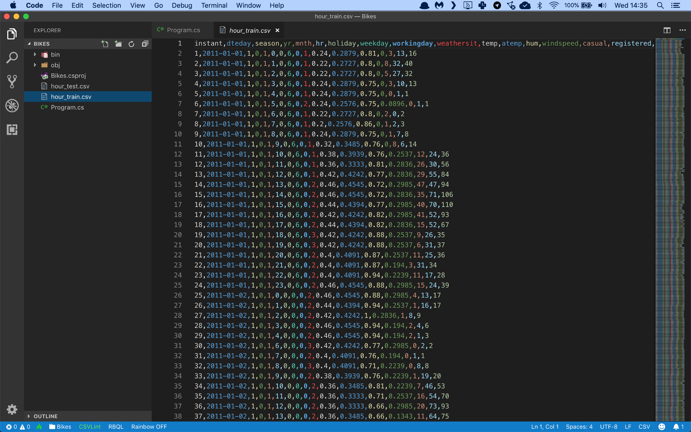

# Assignment: Predict bike sharing demand in Washington DC

In this assignment you're going to build an app that can predict bike sharing demand in Washington DC.

A bike-sharing system is a service in which bicycles are made available to individuals on a short term. Users borrow a bike from a dock and return it at another dock belonging to the same system. Docks are bike racks that lock the bike, and only release it by computer control.

You’ve probably seen docks around town, they look like this:


Bike sharing companies try to even out supply by manually distributing bikes across town, but they need to know how many bikes will be in demand at any given time in the city.

So let’s give them a hand with a machine learning model!

You are going to train a forest of regression decision trees on a dataset of bike sharing demand. Then you’ll use the fully-trained model to make a prediction for a given date and time.

The first thing you will need is a data file with lots of bike sharing demand numbers. We are going to use the [UCI Bike Sharing Dataset](http://archive.ics.uci.edu/ml/datasets/bike+sharing+dataset) from [Capital Bikeshare](https://www.capitalbikeshare.com/) in Metro DC. This dataset has 17,380 bike sharing records that span a 2-year period.

[Download the dataset](https://github.com/mdfarragher/DSC/blob/master/Regression/BikeDemandPrediction/bikedemand.csv) and save it in your project folder as **bikedmand.csv**.

The file looks like this:



It’s a comma-separated file with 17 columns:

* Instant: the record index
* Date: the date of the observation
* Season: the season (1 = springer, 2 = summer, 3 = fall, 4 = winter)
* Year: the year of the observation (0 = 2011, 1 = 2012)
* Month: the month of the observation ( 1 to 12)
* Hour: the hour of the observation (0 to 23)
* Holiday: if the date is a holiday or not
* Weekday: the day of the week of the observation
* WorkingDay: if the date is a working day
* Weather: the weather during the observation (1 = clear, 2 = mist, 3 = light snow/rain, 4 = heavy rain)
* Temperature : the normalized temperature in Celsius
* ATemperature: the normalized feeling temperature in Celsius
* Humidity: the normalized humidity
* Windspeed: the normalized wind speed
* Casual: the number of casual bike users at the time
* Registered: the number of registered bike users at the time
* Count: the total number of rental bikes in operation at the time

You can ignore the record index, the date, and the number of casual and registered bikes, and use everything else as input features. The final column **Count** is the label you're trying to predict.

Let's get started. You need to build a new application from scratch by opening a terminal and creating a new NET Core console project:

```bash
$ dotnet new console -o BikeDemand
$ cd BikeDemand
```

Now install the following packages

```bash
$ dotnet add package Microsoft.ML
$ dotnet add package Microsoft.ML.FastTree
```

Now you are ready to add some classes. You’ll need one to hold a bike demand record, and one to hold your model predictions.

Edit the Program.cs file with Visual Studio Code and add the following code:

```csharp
using System;
using Microsoft.ML;
using System.IO;
using Microsoft.ML.Data;

namespace BikeDemand
{
    /// <summary>
    /// The DemandObservation class holds one single bike demand observation record.
    /// </summary>
    public class DemandObservation
    {
        [LoadColumn(2)] public float Season { get; set; }
        [LoadColumn(3)] public float Year { get; set; }
        [LoadColumn(4)] public float Month { get; set; }
        [LoadColumn(5)] public float Hour { get; set; }
        [LoadColumn(6)] public float Holiday { get; set; }
        [LoadColumn(7)] public float Weekday { get; set; }
        [LoadColumn(8)] public float WorkingDay { get; set; }
        [LoadColumn(9)] public float Weather { get; set; }
        [LoadColumn(10)] public float Temperature { get; set; }
        [LoadColumn(11)] public float NormalizedTemperature { get; set; }
        [LoadColumn(12)] public float Humidity { get; set; }
        [LoadColumn(13)] public float Windspeed { get; set; }
        [LoadColumn(16)] [ColumnName("Label")] public float Count { get; set; }
    }

    /// <summary>
    /// The DemandPrediction class holds one single bike demand prediction.
    /// </summary>
    public class DemandPrediction
    {
        [ColumnName("Score")]
        public float PredictedCount;
    }

    // the rest of the code goes here...
}
```

The **DemandObservation** class holds one single bike trip. Note how each field is tagged with a **LoadColumn** attribute that tells the CSV data loading code which column to import data from.

You're also declaring a **DemandPrediction** class which will hold a single bike demand prediction.

Now you need to load the training data in memory:

```csharp
/// <summary>
/// The main program class.
/// </summary>
static class Program
{
    // filename for data set
    private static string dataPath = Path.Combine(Environment.CurrentDirectory, "bikedemand.csv");
    
    static void Main(string[] args)
    {
        // create the machine learning context
        var context = new MLContext();

        // load the dataset
        Console.WriteLine("Loading data...");
        var data = context.Data.LoadFromTextFile<DemandObservation>(
            path: dataPath, 
            hasHeader:true, 
            separatorChar: ',');

        // split the dataset into 80% training and 20% testing
        var partitions = context.Data.TrainTestSplit(data, testFraction: 0.2);

        // the rest of the code goes here...
    }
}
```

This code uses the method **LoadFromTextFile** to load the training and testing data directly into memory. The class field annotations tell the method how to store the loaded data in the **DemandObservation** class.

Now let’s build the machine learning pipeline:

```csharp
// build a training pipeline
// step 1: concatenate all feature columns
var pipeline = context.Transforms.Concatenate(
    "Features",
    nameof(DemandObservation.Season), 
    nameof(DemandObservation.Year), 
    nameof(DemandObservation.Month),
    nameof(DemandObservation.Hour), 
    nameof(DemandObservation.Holiday), 
    nameof(DemandObservation.Weekday),
    nameof(DemandObservation.WorkingDay), 
    nameof(DemandObservation.Weather), 
    nameof(DemandObservation.Temperature),
    nameof(DemandObservation.NormalizedTemperature), 
    nameof(DemandObservation.Humidity), 
    nameof(DemandObservation.Windspeed))
                                
    // step 2: cache the data to speed up training
    .AppendCacheCheckpoint(context)

    // step 3: use a fast forest learner
    .Append(context.Regression.Trainers.FastForest(
        labelColumnName: "Label",
        featureColumnName: "Features",
        numberOfLeaves: 20,
        numberOfTrees: 100,
        minimumExampleCountPerLeaf: 10));

// train the model
Console.WriteLine("Training the model...");
var trainedModel = pipeline.Fit(partitions.TrainSet);

// the rest of the code goes here...
```

Machine learning models in ML.NET are built with pipelines which are sequences of data-loading, transformation, and learning components.

This pipeline has the following components:

* **Concatenate** which combines all input data columns into a single column called Features. This is a required step because ML.NET can only train on a single input column.
* **AppendCacheCheckpoint** which caches all training data at this point. This is an optimization step that speeds up the learning algorithm.
* A final **FastForest** regression learner which will train the model to make accurate predictions using a forest of decision trees.

The **FastForest** learner is a very nice training algorithm that uses gradient boosting to build a forest of weak decision trees.

Gradient boosting builds a stack of weak decision trees. It starts with a single weak tree that tries to predict the bike demand. Then it adds a second tree on top of the first one to correct the error in the first tree. And then it adds a third tree on top of the second one to correct the output of the second tree. And so on.

The result is a fairly strong prediction model that is made up of a stack of weak decision trees that incrementally correct each other's output. 

Note the use of hyperparameters to configure the learner:

* **NumberOfLeaves** is the maximum number of leaf nodes each weak decision tree will have. In this forest each tree will have at most 10 leaf nodes.
* **NumberOfTrees** is the total number of weak decision trees to create in the forest. This forest will hold 100 trees.
* **MinimumExampleCountPerLeaf** is the minimum number of data points at which a leaf node is split. In this model each leaf is split when it has 10 or more qualifying data points.

These hyperparameters are the default for the **FastForest** learner, but you can tweak them if you want. 

With the pipeline fully assembled, you can train the model on the training partition with a call to **Fit**.

You now have a fully- trained model. So next, you'll have to load the validation data, predict the bike demand, and calculate the accuracy of your model:

```csharp
// evaluate the model
Console.WriteLine("Evaluating the model...");
var predictions = trainedModel.Transform(partitions.TestSet);
var metrics = context.Regression.Evaluate(
    data: predictions, 
    labelColumnName: "Label",
    scoreColumnName: "Score");

// show evaluation metrics
Console.WriteLine($"   RMSE: {metrics.RootMeanSquaredError}");
Console.WriteLine($"   MSE:  {metrics.MeanSquaredError}");
Console.WriteLine($"   MAE:  {metrics.MeanAbsoluteError}");

// the rest of the code goes here...
```

This code calls **Transform** to set up predictions for every single bike demand record in the test partition. The **Evaluate** method then compares these predictions to the actual bike demand and automatically calculates these metrics:

* **RootMeanSquaredError**: this is the root mean squared error or RMSE value. It’s the go-to metric in the field of machine learning to evaluate models and rate their accuracy. RMSE represents the length of a vector in n-dimensional space, made up of the error in each individual prediction.
* **MeanSquaredError**: this is the mean squared error, or MSE value. Note that RMSE and MSE are related: RMSE is the square root of MSE.
* **MeanAbsoluteError**: this is the mean absolute prediction error or MAE value, expressed in number of bikes.

To wrap up, let’s use the model to make a prediction.

I want to rent a bike in the fall of 2012, on a Thursday in August at 10am in the morning in clear weather. What will the bike demand be on that day?

Here’s how to make that prediction:

```csharp
// set up a sample observation
var sample = new DemandObservation()
{
    Season = 3,
    Year = 1,
    Month = 8,
    Hour = 10,
    Holiday = 0,
    Weekday = 4,
    WorkingDay = 1,
    Weather = 1,
    Temperature = 0.8f,
    NormalizedTemperature = 0.7576f,
    Humidity = 0.55f,
    Windspeed = 0.2239f
};

// create a prediction engine
var engine = context.Model.CreatePredictionEngine<DemandObservation, DemandPrediction>(trainedModel);

// make the prediction
Console.WriteLine("Making a prediction...");
var prediction = engine.Predict(sample);

// show the prediction
Console.WriteLine($"   {prediction.PredictedCount}");

```

You create a new **DemandObservation** instance and use the **CreatePredictionEngine** method to set up a prediction engine. The two type arguments are the input data class and the class to hold the prediction. And when the prediction engine is set up you can simply call **Predict** to make a single prediction.

What will the model prediction be?

Time to find out. Go to your terminal and run your code:

```bash
$ dotnet run
```

What results do you get? What are your RMSE and MAE values? Is this a good result? 

And what bike demand does your model predict on the day I wanted to take my bike ride? 

Now take a look at the hyperparameters. Try to change the behavior of the fast forest learner and see what happens to the accuracy of your model. Did your model improve or get worse? 

Share your results in our group!
