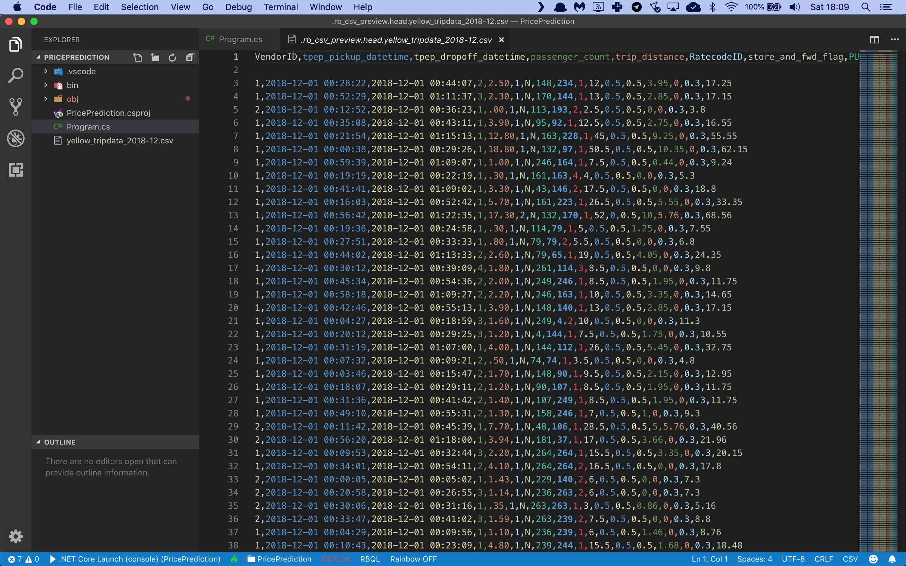

# Assignment: Predict taxi fares in New York

In this assignment you're going to build an app that can predict taxi fares in New York.

The first thing you'll need is a data file with transcripts of New York taxi rides. The [NYC Taxi & Limousine Commission](https://www1.nyc.gov/site/tlc/about/tlc-trip-record-data.page) provides yearly TLC Trip Record Data files which have exactly what you need.

Download the [Yellow Taxi Trip Records from December 2018](https://s3.amazonaws.com/nyc-tlc/trip+data/yellow_tripdata_2018-12.csv) and save it as **yellow_tripdata_2018-12.csv**. 

This is a CSV file with 8,173,233 records that looks like this:





There are a lot of columns with interesting information in this data file, but you will only train on the following:

* Column 0: The data provider vendor ID
* Column 3: Number of passengers
* Column 4: Trip distance
* Column 5: The rate code (standard, JFK, Newark, …)
* Column 9: Payment type (credit card, cash, …)
* Column 10: Fare amount

You are going to build a machine learning model in C# that will use columns 0, 3, 4, 5, and 9 as input, and use them to predict the taxi fare for every trip. Then you’ll compare the predicted fares with the actual taxi fares in column 10, and evaluate the accuracy of your model.

Let's get started. You need to build a new application from scratch by opening a terminal and creating a new NET Core console project:

```bash
$ dotnet new console -o PricePrediction
$ cd PricePrediction
```

Now install the following packages

```bash
$ dotnet add package Microsoft.ML
$ dotnet add package Microsoft.ML.FastTree
```

Now you are ready to add some classes. You’ll need one to hold a taxi trip, and one to hold your model predictions.

Edit the Program.cs file with Visual Studio Code and add the following code:

```csharp
using System;
using System.IO;
using Microsoft.ML;
using Microsoft.ML.Data;

namespace TaxiFarePrediction
{
    /// <summary>
    /// The TaxiTrip class represents a single taxi trip.
    /// </summary>
    public class TaxiTrip
    {
        [LoadColumn(0)] public string VendorId;
        [LoadColumn(5)] public string RateCode;
        [LoadColumn(3)] public float PassengerCount;
        [LoadColumn(4)] public float TripDistance;
        [LoadColumn(9)] public string PaymentType;
        [LoadColumn(10)] public float FareAmount;
    }

    /// <summary>
    /// The TaxiTripFarePrediction class represents a single fare prediction.
    /// </summary>
    public class TaxiTripFarePrediction
    {
        [ColumnName("Score")]
        public float FareAmount;
    }

    // the rest of the code goes here...
}
```

The **TaxiTrip** class holds one single taxi trip. Note how each field is tagged with a **LoadColumn** attribute that tells the CSV data loading code which column to import data from.

You're also declaring a **TaxiTripFarePrediction** class which will hold a single fare prediction.

Now you need to load the training data in memory:

```csharp
/// <summary>
/// The program class.
/// </summary>
class Program
{
    // file paths to data files
    static readonly string dataPath = Path.Combine(Environment.CurrentDirectory, "yellow_tripdata_2018-12.csv");

    /// <summary>
    /// The main application entry point.
    /// </summary>
    /// <param name="args">The command line arguments.</param>
    static void Main(string[] args)
    {
        // create the machine learning context
        var mlContext = new MLContext();

        // set up the text loader 
        var textLoader = mlContext.Data.CreateTextLoader(
            new TextLoader.Options() 
            {
                Separators = new[] { ',' },
                HasHeader = true,
                Columns = new[] 
                {
                    new TextLoader.Column("VendorId", DataKind.String, 0),
                    new TextLoader.Column("RateCode", DataKind.String, 5),
                    new TextLoader.Column("PassengerCount", DataKind.Single, 3),
                    new TextLoader.Column("TripDistance", DataKind.Single, 4),
                    new TextLoader.Column("PaymentType", DataKind.String, 9),
                    new TextLoader.Column("FareAmount", DataKind.Single, 10)
                }
            }
        );

        // load the data 
        Console.Write("Loading training data....");
        var dataView = textLoader.Load(dataPath);
        Console.WriteLine("done");

        // split into a training and test partition
        var partitions = mlContext.Data.TrainTestSplit(dataView, testFraction: 0.2);

        // the rest of the code goes here...
    }
}
```

This code sets up a **TextLoader** to load the CSV data into memory. Note that all column data types are what you’d expect, except **RateCode** and **PaymentType**. These columns hold numeric values, but you are loading then as string fields.

The reason you need to do this is because RateCode is an enumeration with the following values:

* 1 = standard
* 2 = JFK
* 3 = Newark
* 4 = Nassau
* 5 = negotiated
* 6 = group

And PaymentType is defined as follows:

* 1 = Credit card
* 2 = Cash
* 3 = No charge
* 4 = Dispute
* 5 = Unknown
* 6 = Voided trip

These actual numbers don’t mean anything in this context. And we certainly don’t want the machine learning model to start believing that a trip to Newark is three times as important as a standard fare.

So converting these values to strings is a perfect trick to show the model that **RateCode** and **PaymentType** are just labels, and the underlying numbers don’t mean anything.

With the TextLoader all set up, a single call to **Load** is sufficient to load the entire data file in memory.

There is only one single data file, so you need to call **TrainTestSplit** to set up a training partition with 80% of the data and a test partition with the remaining 20% of the data.

You often see this 80/20 split in data science, it’s a very common approach to train and test a model.

Now you’re ready to start building the machine learning model:

```csharp
// set up a learning pipeline
var pipeline = mlContext.Transforms.CopyColumns(
    inputColumnName:"FareAmount", 
    outputColumnName:"Label")

    // one-hot encode all text features
    .Append(mlContext.Transforms.Categorical.OneHotEncoding("VendorId"))
    .Append(mlContext.Transforms.Categorical.OneHotEncoding("RateCode"))
    .Append(mlContext.Transforms.Categorical.OneHotEncoding("PaymentType"))

    // combine all input features into a single column 
    .Append(mlContext.Transforms.Concatenate(
        "Features", 
        "VendorId", 
        "RateCode", 
        "PassengerCount", 
        "TripDistance", 
        "PaymentType"))

    // cache the data to speed up training
    .AppendCacheCheckpoint(mlContext)

    // use the fast tree learner 
    .Append(mlContext.Regression.Trainers.FastTree());

// train the model
Console.Write("Training the model....");
var model = pipeline.Fit(partitions.TrainSet);
Console.WriteLine("done");

// the rest of the code goes here...
```


Machine learning models in ML.NET are built with pipelines which are sequences of data-loading, transformation, and learning components.

This pipeline has the following components:

* **CopyColumns** which copies the FareAmount column to a new column called Label. This Label column holds the actual taxi fare that the model has to predict.
* A group of three **OneHotEncodings** to perform one hot encoding on the three columns that contains enumerative data: VendorId, RateCode, and PaymentType. This is a required step because machine learning models cannot handle enumerative data directly.
* **Concatenate** which combines all input data columns into a single column called Features. This is a required step because ML.NET can only train on a single input column.
* **AppendCacheCheckpoint** which caches all data in memory to speed up the training process.
* A final **FastTree** regression learner which will train the model to make accurate predictions.

The **FastTreeRegressionTrainer** is a very nice training algorithm that uses gradient boosting, a machine learning technique for regression problems.

A gradient boosting algorithm builds up a collection of weak regression models. It starts out with a weak model that tries to predict the taxi fare. Then it adds a second model that attempts to correct the error in the first model. And then it adds a third model, and so on.

The result is a fairly strong prediction model that is actually just an ensemble of weaker prediction models stacked on top of each other.

We will explore Gradient Boosting in detail in a later section.

With the pipeline fully assembled, you can train the model on the training partition with a call to **Fit**.

You now have a fully- trained model. So next, you'll have to load the validation data, predict the taxi fare for each trip, and calculate the accuracy of your model:

```csharp
// get a set of predictions 
Console.Write("Evaluating the model....");
var predictions = model.Transform(partitions.TestSet);

// get regression metrics to score the model
var metrics = mlContext.Regression.Evaluate(predictions, "Label", "Score");
Console.WriteLine("done");

// show the metrics
Console.WriteLine();
Console.WriteLine($"Model metrics:");
Console.WriteLine($"  RMSE:{metrics.RootMeanSquaredError:#.##}");
Console.WriteLine($"  MSE: {metrics.MeanSquaredError:#.##}");
Console.WriteLine($"  MAE: {metrics.MeanAbsoluteError:#.##}");
Console.WriteLine();

// the rest of the code goes here...
```

This code calls **Transform** to set up predictions for every single taxi trip in the test partition. The **Evaluate**(…) method then compares these predictions to the actual taxi fares and automatically calculates these metrics:

* **RootMeanSquaredError**: this is the root mean squared error or RMSE value. It’s the go-to metric in the field of machine learning to evaluate models and rate their accuracy. RMSE represents the length of a vector in n-dimensional space, made up of the error in each individual prediction.
* **MeanAbsoluteError**: this is the mean absolute prediction error or MAE value, expressed in dollars.
* **MeanSquaredError**: this is the mean squared error, or MSE value. Note that RMSE and MSE are related: RMSE is the square root of MSE.

To wrap up, let’s use the model to make a prediction.

Imagine that I'm going to take a standard taxi trip, I cover a distance of 3.75 miles, I am the only passenger, and I pay by credit card. What would my fare be? 

Here’s how to make that prediction:

```csharp
// create a prediction engine for one single prediction
var predictionFunction = mlContext.Model.CreatePredictionEngine<TaxiTrip, TaxiTripFarePrediction>(model);

// prep a single taxi trip
var taxiTripSample = new TaxiTrip()
{
    VendorId = "2",
    RateCode = "1",
    PassengerCount = 1,
    TripDistance = 3.75f,
    PaymentType = "1",
    FareAmount = 0 // the model will predict the actual fare for this trip
};

// make the prediction
var prediction = predictionFunction.Predict(taxiTripSample);

// sho the prediction
Console.WriteLine($"Single prediction:");
Console.WriteLine($"  Predicted fare: {prediction.FareAmount:0.####}");
```

You use the **CreatePredictionEngine** method to set up a prediction engine. The two type arguments are the input data class and the class to hold the prediction. And once the prediction engine is set up, you can simply call **Predict** to make a single prediction.

The trip should cost anywhere between $13.50 and $18.50, depending on the trip duration (which depends on the time of day). Will the model predict a fare in this range?  

Let's find out. Go to your terminal and run your code:

```bash
$ dotnet run
```

What results do you get? What are your RMSE and MAE values? Is this a good result? 

And how much does your model predict I have to pay for my taxi ride? Is the prediction in the range of accetable values for this trip? 

Now make some changes to my trip. Change the vendor ID, or the distance, or the manner of payment. How does this affect the final fare prediction? And what do you think this means?  

Think about the code in this assignment. How could you improve the accuracy of the model? What's your best RMSE value? 

Share your results in our group!
