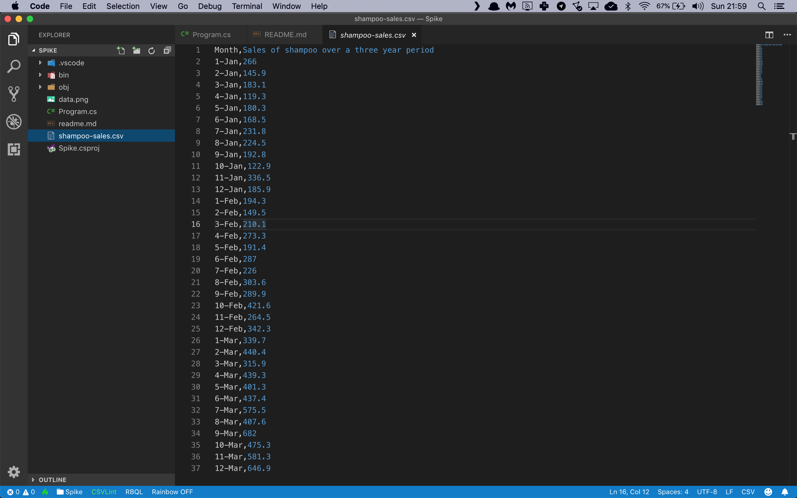

# Assignment: Detect sales spikes and trend changes

In this assignment you're going to build an app that can detect anomalous spikes and trend changes in a sales dataset. In the world of data science, this type of task is called **Time Series Anomaly Detection**.

The first thing you'll need for your app is a data file to analyze. We are going to use the Shampoo Sales Dataset from DataMarket. This is a very simple set that contains shampoo sales volume for a hypothetical company over a 36-day period.

[Download the sales file](https://github.com/mdfarragher/DSC/blob/master/TimeSeries/SalesSpikes/shampoo-sales.csv) and save it in your project folder as **shampoo-sales.csv**.

Here’s what the dataset looks like:




It’s a very simple CSV file with only two columns:

* The date for the sales record
* The number of shampoo bottles sold on that date

You are going to build a data science app that reads in each sales record and then identifies every irregular sales spike in the data.

Let’s get started. Here’s how to set up a new console project in NET Core:

```bash
$ dotnet new console -o SalesSpikes
$ cd SalesSpikes
```

Now install the following packages

```bash
$ dotnet add package Microsoft.ML
$ dotnet add package Microsoft.ML.TimeSeries
$ dotnet add package plplot
```

C# developers do not get access to the awesome matplotlib library that Python programmers have access to. But fortunately there’s a really nice alternative called **PLplot**. It’s an advanced scientific plotting library and it comes with full C# support.

On Windows you can use the Nuget package out of the box. But if you use a Mac like me, you’ll have to install plplot with homebrew first:

```bash
$ brew install plplot
```

And here's how to install plplot on Linux:

```bash
$ sudo apt install libplplot15 plplot-driver-cairo
```

Now you're ready to add some classes. You will need one class to hold a sales record, and one to hold your model predictions.

Modify the Program.cs file like this:

```csharp
using System;
using System.IO;
using System.Linq;
using Microsoft.ML;
using Microsoft.ML.Data;
using PLplot;

namespace SalesSpikes
{
    /// <summary>
    /// The SalesRecord class contains one shampoo sales record.
    /// </summary>
    public class SalesRecord
    {
        [LoadColumn(0)] public string Month;
        [LoadColumn(1)] public float Sales;
    }

    /// <summary>
    /// The SalesPrediction class contains one shampoo sales prediction.
    /// </summary>
    public class SalesPrediction
    {
        //vector to hold alert,score,p-value values
        [VectorType(3)] public double[] Prediction { get; set; }
    }

    // the rest of the code goes here...
}
```

The **SalesRecord** class holds one single sales record. Note how each field is tagged with a **LoadColumn** attribute that tell the CSV data loading code which column to import data from.

There's also a **SalesPrediction** class which will hold a single sales prediction. Note that the prediction field is tagged with a **VectorType** attribute that tells ML.NET that each prediction consists of 3 numbers. The tag is required because the spike detector returns an alert value, a score, and a p-value for every prediction. 

Next you need to load the sales data in memory:


```csharp
/// <summary>
/// The main program class.
/// </summary>
public class Program
{
    // filename for data set
    private static string dataPath = Path.Combine(Environment.CurrentDirectory, "shampoo-sales.csv");

    /// <summary>
    /// The main program entry point.
    /// </summary>
    /// <param name="args">The command line parameters.</param>
    static void Main()
    {
        // create the machine learning context
        var context = new MLContext();

        // load the data file
        Console.WriteLine("Loading data...");
        var dataView = context.Data.LoadFromTextFile<SalesRecord>(path: dataPath, hasHeader: true, separatorChar: ',');

        // get an array of data points
        var sales = context.Data.CreateEnumerable<SalesRecord>(dataView, reuseRowObject: false).ToArray();

        // the rest of the code goes here...
    }
}
```

This code uses the method **LoadFromTextFile** to load the CSV data directly into memory. The class field annotations tell the method how to store the loaded data in the **SalesRecord** class.

The data is now stored in a data view, but we want to work with the sales records directly. So you need to call **CreateEnumerable** to convert the data view to an enumeration of **SalesRecord** instances.

Let’s start by plotting the sales records to get an idea of what the data looks like. Add the following code:

```csharp
// plot the data
var pl = new PLStream();
pl.sdev("pngcairo");                // png rendering
pl.sfnam("data.png");               // output filename
pl.spal0("cmap0_alternate.pal");    // alternate color palette
pl.init();
pl.env(
    0, 36,                          // x-axis range
    0, 800,                         // y-axis range
    AxesScale.Independent,          // scale x and y independently
    AxisBox.BoxTicksLabelsAxes);    // draw box, ticks, and num ticks
pl.lab(
    "Date",                         // x-axis label
    "Sales",                        // y-axis label
    "Shampoo sales over time");     // plot title
pl.line(
    (from x in Enumerable.Range(0, sales.Count()) select (double)x).ToArray(),
    (from p in sales select (double)p.Sales).ToArray()
);
pl.eop();

// the rest of the code goes here...
```

The **sdev** method sets the rendering device and the **sfnam** method sets the output filename. We call **spal0** to set an alternate color palette, **init** to initialize the plot, **env** to set up the axes, and **lab** to set up the labels.

The **line** method draws a line from two array of x- and y-coordinates. My code uses two LINQ queries to provide a range of 0..35 for x and the corresponding sales numbers for y.

The final **eop** method closes the plot and saves it to disk.

Run the app on the console like this:

```bash
$ dotnet run
```

What does the plot look like? Where do you think the sales spikes are?

Now we will identify all anomalies in the data. We are going to use an ML.NET algorithm called **DetectIidSpike**.

‘IID’ refers to **Independent and Identically Distributed**. It means that each sales record is independent from all other sales records, and the probability distribution of all sales records are the same.

Sales anomalies are outliers in the data. They are points in the time-series where the data behaves differently from what is expected. These deviations usually indicate the presence of interesting events that we want to focus on.

There are two types of anomalies: spikes which are sudden yet temporary bursts in the values of the input time-series, and change points which indicate the beginning of a persistent trend change in the system

Let’s start by detecting all spikes. Here’s how to do spike estimation in ML.NET.

First remove the final **pl.eop** call, and then add the following code:

```csharp
// build a training pipeline for detecting spikes
var pipeline = context.Transforms.DetectIidSpike(
    outputColumnName: nameof(SalesPrediction.Prediction), 
    inputColumnName: nameof(SalesRecord.Sales),
    confidence: 95, 
    pvalueHistoryLength: sales.Count() / 4); // 25% of x-range

// train the model
Console.WriteLine("Detecting spikes...");
var model = pipeline.Fit(dataView);

// predict spikes in the data
var transformed = model.Transform(dataView);
var predictions = context.Data.CreateEnumerable<SalesPrediction>(transformed, reuseRowObject: false).ToArray();

// the rest of the code goes here...
```

Machine learning models in ML.NET are built with pipelines, which are sequences of data-loading, transformation, and learning components.

This pipeline has only one component:

* **DetectIidSpike** which reads the sales records and detects all anomalous spikes in the data. You have to provide the input and output column names, a confidence threshold, and the size of the sliding window used during estimation.

We are configuring the spike estimator to use a 95% confidence threshold and a window that spans 25% of the x-value range.

With the pipeline fully assembled, you can train the model on the data with a call to **Fit** and then call **Transform** to make spike predictions for every sales record in the data set.

Finally the code calls **CreateEnumerable** to convert the **transformed** variable to an enumeration of **SalesPrediction** instances.

Each sales prediction instance now holds a vector with three values:

* An alert value that is equal to 1 for a sales spike (that exceeded the specified threshold) and 0 otherwise.
* The predicted sales value.
* The p-value. This is a metric between zero and one. The lower the value, the larger the probability that we’re looking at a spike.

We can highlight the spikes in the plot with the following code:

```csharp
// find the spikes in the data
var spikes = (from i in Enumerable.Range(0, predictions.Count()) 
                where predictions[i].Prediction[0] == 1
                select (Day: i, Sales: sales[i].Sales));

// plot the spikes
pl.col0(2);     // blue color
pl.schr(3, 3);  // scale characters
pl.string2(
    (from s in spikes select (double)s.Day).ToArray(),
    (from s in spikes select (double)s.Sales + 40).ToArray(),
    "↓");
pl.eop();

// the rest of the code goes here...
```

The code uses a LINQ query to select all spike predictions with the alert value equal to 1, and calls the **pl.string2** method to highlight these locations in the graph with a down-arrow symbol.

Run your app. Where are all the sales spikes predicted by the model? 

Now let’s try and find the change points. Remove the final **pl.eop** and add the following code:

```csharp
// build a training pipeline for detecting change points
var pipeline2 = context.Transforms.DetectIidChangePoint(
    outputColumnName: nameof(SalesPrediction.Prediction), 
    inputColumnName: nameof(SalesRecord.Sales), 
    confidence: 95, 
    changeHistoryLength: sales.Count() / 4); // 25% of x-range

// train the model
Console.WriteLine("Detecting change points...");
var model2 = pipeline2.Fit(dataView);

// get predictions
transformed = model2.Transform(dataView);
predictions = context.Data.CreateEnumerable<SalesPrediction>(transformed, reuseRowObject: false).ToArray();

// the rest of the code goes here...
```

This new pipeline has only one component:

* **DetectIidChangePoint** which reads the sales records and estimates all change points in the data. We have to provide the input and output column names, a confidence threshold, and the size of the sliding window used during estimation.

We are configuring the change point estimator with the same values we used before: a 95% confidence threshold and a window that spans 25% of the x-value range.

With the pipeline fully assembled, we can train the model on the data with a call to **Fit** and then call **Transform** to make change point predictions for every sales record in the data set.

Finally the code calls **CreateEnumerable** to convert the **transformed** variable to an enumeration of **SalesPrediction** instances.

Each sales prediction instance now holds a vector with four(!) values:

* An alert value that is equal to 1 for a change point (that exceeded the specified threshold) and 0 otherwise.
* The predicted sales value.
* The p-value. This is a metric between zero and one. The lower the value, the larger the probability that we’re looking at a spike.
* The Martingale value. This represents the deviation of the current value from the previous trend. High values indicate a change point.

We can highlight the change points in the plot with the following code:

```csharp
// find the change points in the data
var changes = (from i in Enumerable.Range(0, predictions.Count()) 
                where predictions[i].Prediction[0] == 1
                select (Day: i, Sales: sales[i].Sales));

// plot the change points as vertical red lines
pl.col0(3);
foreach (var c in changes)
    pl.line(new double[] { c.Day, c.Day }, new double[] { 0, 800});
pl.eop();
```

The code uses a LINQ query to select all change point predictions with the alert value equal to 1, and calls the **pl.line** method to draw a vertical red line in these locations in the graph.

Now run the completed app in your terminal:

```bash
$ dotnet run
```

What does the final result look like? Where are the predicted sales spikes, and where is the change point?

Do you agree with these predictions? 

Share your results in our group.
